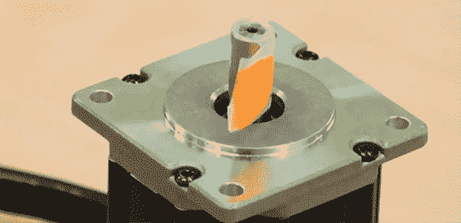

# 恩智浦带电机控制器的 ARM 微处理器

> 原文：<https://hackaday.com/2014/02/25/nxps-arm-micros-with-motor-controllers/>

现在仍然是年初，所有这些硅制造商都在推出新的玩具，以满足未来几年工程师和爱好者的需求。恩智浦的产品是 [LPC1500](http://www.nxp.com/products/microcontrollers/cortex_m3/series/LPC1500.html) ，这是一系列针对电机和运动控制应用而优化的 ARM 微控制器。

新芯片的规格包括 72MHz 的 ARM Cortex-M3，高达 256kB 的闪存，36kB 的 SRAM，USB，CAN，28 个 PWM 输出，一个实时时钟。LPC1500 上有控制无刷、永磁或交流感应电机的选项，每种类型的电机都有开发板。每个芯片支持两个引脚尽管恩智浦[承诺采用 DIP 封装 ARM 芯片](http://hackaday.com/2013/10/15/breadboarding-with-a-arm-microcontroller/)，LPC1500 芯片仅提供 48、64 和 100 引脚的 QFP 封装。

不要认为 LPC1500 是 CNC 控制器的完美芯片——该芯片只支持控制两个电机。然而，这将是一个构建一些机器人、电动汽车或我们在这里看到的许多其他真正酷的项目的奇妙平台。