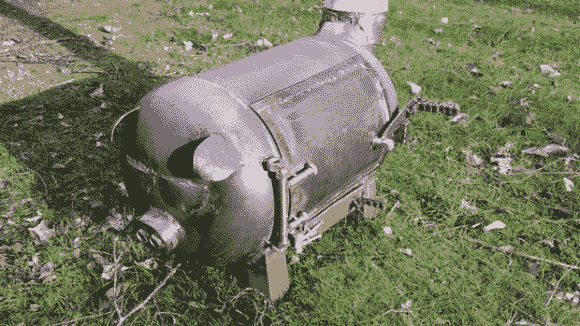

# 这只小猪呆在家里，变成了一个火炉

> 原文：<https://hackaday.com/2014/02/25/this-little-piggy-stayed-home-and-became-a-stove/>

这只小猪可能应该去市场。取而代之的是，它变成了一个极具装饰性的、可爱的、[燃烧木头的火炉！](http://www.instructables.com/id/Piglet-shaped-wood-burner-from-an-old-bottle)

在受到一个类似的指导你使用一个过期的气瓶制作一个木头火炉的启发后，[Ruudvande]不得不亲自尝试。问题是——他没有油箱。幸运的是，他找到了这样做的人，但事实证明，他们想把它变成一个烧烤！所以，稍微偏离主题，他用圆柱体的中心为他们做了一个烤肉架，并保留了末端和足够的钢来做小猪先生。

几乎整个燃木炉都是由碎钢和各种安装硬件组成的。仅用一台 MIG 焊机，[Ruudvande]手工将它焊接在一起，我们认为结果非常棒！不过他对此还不太满意，计划升级烟囱，在里面放一个更大的烤架，粉刷一下，甚至在门上加一扇玻璃窗。