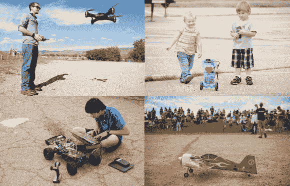

# Sparkfun 的 AVC 2014:机器人、直升机和红色死亡气球，天啊！

> 原文：<https://hackaday.com/2014/02/27/sparkfuns-avc-2014-robots-copters-and-red-balloons-of-death-oh-my/>

Sparkfun 的 [2014 自动驾驶汽车竞赛(AVC)](https://avc.sparkfun.com/) 开始报名啦！Sparkfun 的精英们每年都会邀请人们带着他们的机器人、漫游者和无人机来到科罗拉多州，看看谁是山丘之王——或者水库之王。我们在 [Hackaday](http://hackaday.com/2013/05/28/wireless-rover-with-android-control/) 这里看到[很多](http://hackaday.com/2014/01/21/gamecube-robot-is-more-than-meets-the-eye/)[机器人](http://hackaday.com/2014/01/15/rc-rock-crawler-prepped-to-become-stair-climbing-robot/)，但是它们中很少是自主的。对我们来说，这意味着无需人工干预就能完成复杂的任务。Sparkfun 花了五年时间致力于改变这种状况。每年，机器人变得越来越复杂，完成越来越困难的任务。

这场比赛实质上是一场穿越博尔德水库的比赛。时间是关键，尽管有多种方法可以获得奖励积分。对于飞行器来说，有两类:固定翼和旋转翼。飞机属于固定翼类。直升机、旋翼机、三翼机、四翼机等等都属于旋翼飞机。我们希望 e-volo 会带着他们的十八翼直升机出现。地面车辆有更多的职业选择。微型/PBR 级机器人的制造成本低于 350 美元，或者小到可以装进 10×6×4 的盒子里。兴奋剂等级不限。Sparkfun 甚至提到成本超过 1 千美元，重量超过 25 磅。非传统运动课程是为步行者、[野猫](http://hackaday.com/2013/10/05/boston-dynamics-takes-wildcat-outside/)之类的人开设的。Peloton 是 Sparkfun 为不适合其他职业的机器人设计的职业。

Sparkfun 今年也对球场做了一些改变。一条白色的粉笔线将贯穿整个课程，因此机器人不必单独依赖 GPS 进行导航。我们希望至少能看到一些视觉系统使用这种粉笔线。空中机器人将不得不与三个“红色死亡气球”抗衡。机器人可以不受惩罚地在气球周围导航。气球可以被撞，甚至弹出加分，但机器人必须用自己的身体来做。不允许使用投射武器。说我们对 AVC 感到兴奋是一种保守的说法。虽然我们喜欢观看像 [DARPA 机器人挑战赛](http://hackaday.com/2013/12/22/darpa-robotics-challenge-trials-wrap-up/)这样的比赛中的大玩家，但我们也喜欢看到个人和业余爱好者的小团队每年在 AVC 比赛。点击观看 Sparkfun 的 AVC 2013 总结视频。

[https://www.youtube.com/embed/9TRmu7fx_Xw?version=3&rel=1&showsearch=0&showinfo=1&iv_load_policy=1&fs=1&hl=en-US&autohide=2&wmode=transparent](https://www.youtube.com/embed/9TRmu7fx_Xw?version=3&rel=1&showsearch=0&showinfo=1&iv_load_policy=1&fs=1&hl=en-US&autohide=2&wmode=transparent)