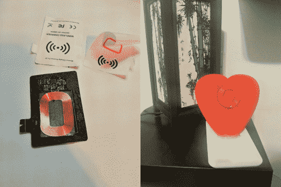

# 无线充电…发发善心吧

> 原文：<https://hackaday.com/2014/02/28/wireless-charging-have-a-heart/>

[Gal Naim]最近为一个特别的人完成了一份很棒的情人节礼物。是一颗[给你手机的无线充电心脏！](http://www.instructables.com/id/Wireless-Charger-3d-Printed-Heart/)

他已经有了 Qi 无线充电器，但不太喜欢它，因为它“看起来很无聊”。所以他把它拆开，为他的新项目抢救充电电路。幸运的是,“气”的内部非常简单——他所要做的就是把电线延长到线圈上。然后，他在 SolidWorks 中设计了他的心脏——别忘了查看我们的 3D 打印教程——并用漂亮的糖果苹果红打印出来。为了最大化充电电流，他把感应线圈放在外面，这样它就可以尽可能靠近手机——他把它喷成红色，看起来真的很酷！

下一步是为手机添加无线充电功能，我们已经介绍了如何在之前将这一功能添加到任何手机，但对于[Gal]来说，这就像剪下 Qi 接收器卡以适合手机一样简单。

[https://www.youtube.com/embed/Z-gsfC401Ts?version=3&rel=1&showsearch=0&showinfo=1&iv_load_policy=1&fs=1&hl=en-US&autohide=2&wmode=transparent](https://www.youtube.com/embed/Z-gsfC401Ts?version=3&rel=1&showsearch=0&showinfo=1&iv_load_policy=1&fs=1&hl=en-US&autohide=2&wmode=transparent)

如果你想要更多的挑战，你可以制作自己的感应充电回路！