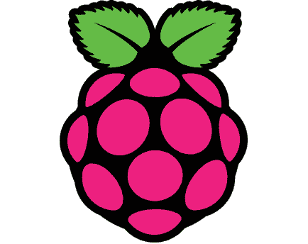

# 树莓 Pi GPU 去开源！地震 3 悬赏 10，000 美元

> 原文：<https://hackaday.com/2014/02/28/raspberry-pi-gpu-goes-open-source-10000-bounty-for-quake-3/>

树莓派人群中的一个棘手问题是封闭源代码的 GPU。今天一切都变了。[Eben Upton]报道称 [Broadcom 正在向 VideoCore IV 3D 图形子系统开放源代码](http://blog.broadcom.com/chip-design/android-for-all-broadcom-gives-developers-keys-to-the-videocore-kingdom/)。用博通自己的话说:

> VideoCore 驱动程序堆栈包括一个完整的符合标准的 OpenGL ES 着色语言编译器，它是根据 3 条款 BSD 许可证提供的；源代码版本附有图形引擎的完整注册级文档

[Broadcom 的支持网站](http://www.broadcom.com/support/)上提供了完整的文档。为了庆祝这一点，Raspberry Pi 基金会向第一个用开源驱动程序在 Raspberry Pi 上以可播放的帧率运行雷神之锤 3 的人提供[1 万美元。竞争是全球性的。](http://www.raspberrypi.org/archives/6299)[此处提供全部规则](http://www.raspberrypi.org/competition-rules)。

这个版本并没有涵盖所有内容，因为 Pi 的 BCM2835 仍然有一部分隐藏在 blob 文件后面。但是，对于开源来说，这是非常大的一步。恭喜树莓派团队，祝所有参赛者好运。