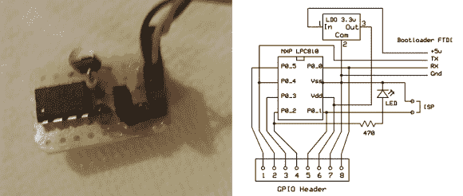

# Catweazle Mini:基于超小型 ARM 的嵌入式平台

> 原文：<https://hackaday.com/2014/02/28/the-catweazle-mini-a-super-small-arm-based-embedded-platform/>

最近有一种趋势是将嵌入式平台小型化。[Jan]写信告诉我们他的非常小的基于 ARM 的嵌入式平台，Catweazle Mini。谁知道基于 ARM 的系统会如此简单和小巧？！？

随着[饰品](http://www.adafruit.com/products/1501)和 [Femtoduino](http://hackaday.com/2011/02/21/ultrasmall-arduino/) (微型 Arduino 兼容板)以及许多其他 KickStarter 活动的成功，基于 ARM 架构的迷你平台的出现是很自然的。这款小型嵌入式平台围绕恩智浦[LP c810](http://www.nxp.com/products/microcontrollers/cortex_m0_m0/lpc800/LPC810M021FN8.html)ARM Cortex M0+30 MHz MCU(顺便说一下，其价格仅略高于 1 美元)构建，具有一些令人印象深刻的处理能力。该板包含一个简单的线性调节器，可以通过 UART 编程。[Jan]选择的开发环境是 mbed 编译器，它是免费的，不需要安装。如果您需要一些入门帮助，Adafruit 为 LPC810 提供了很好的[指南。](http://learn.adafruit.com/getting-started-with-the-lpc810/introduction)

你的下一个[可穿戴项目](http://hackaday.com/2014/02/17/make-your-own-smart-watch/)需要更多的处理能力吗？一定要用 Catweazle Mini。