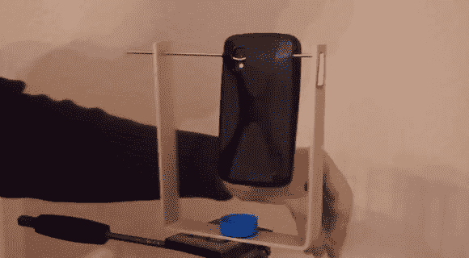

# 光球技术变得简单又便宜

> 原文：<https://hackaday.com/2014/03/01/photosphereing-made-easy-and-cheap/>

Android 手机有一个很酷的功能，叫做 Photo Sphere——不幸的是，除非你非常稳定，可以围绕相机的轴操纵手机……结果并不那么令人惊讶。除非你为你的三脚架做一个便宜的 360 度全景头。

[奥利弗·克罗恩]设计了这个超级简单的适配器，可以安装在任何三脚架上。这是一个 U 形弯曲的铝片，一个带有 1/4-20 螺母的瓶盖，一根粗电线，和一个手机壳。电线弯曲有一个缺口，正好位于手机相机镜头的下方——它也直接位于三脚架平移轴的上方。这就把节点放在了一个完美的地方，每次都能拍出一个很棒的照片球。

来看看它是如何工作的(以及惊人的结果！)以下视频请继续关注。

[https://www.youtube.com/embed/7BJBmH_FRgI?version=3&rel=1&showsearch=0&showinfo=1&iv_load_policy=1&fs=1&hl=en-US&autohide=2&wmode=transparent](https://www.youtube.com/embed/7BJBmH_FRgI?version=3&rel=1&showsearch=0&showinfo=1&iv_load_policy=1&fs=1&hl=en-US&autohide=2&wmode=transparent)

想 360 度录制视频吗？你将需要[第二台摄像机……](http://hackaday.com/2010/01/14/spherical-and-stereoscopic-photography/)