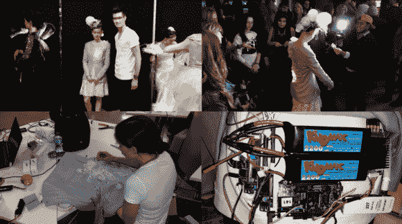

# RFID 夹克在 2014 年 Make Fashion 展会上惊艳全场

> 原文：<https://hackaday.com/2014/03/04/rfid-jacket-flashes-the-crowd-at-make-fashion-2014/>

[RADLab 团队]为 2014 年的【T2 时尚】制作了一件[令人大开眼界的 RFID 夹克](http://saitradlab.ca/make-fashion-2014-proxima/)。在这个项目中，RADLab 的[丹·达姆龙、克里斯·扎尔和本·里德]与设计师[劳拉·邓普西]合作，设计了一款既能迎合 t 台上的舞者又能迎合观众的夹克。RADLab 代表射频识别应用开发实验室，因此您可能会猜到 RFID 是他们进行交互的首选武器。我们[在 Hackaday 这里获得了一点 RFID 体验](http://projects.hackaday.com/project/7-%22Chad%22---The-NFC-Voting-System)，最近在洛杉矶的聚会[上使用了它。[RADLab 团队]没有在这件夹克的处理能力上吝啬。一个小猎犬般的黑人掌管着 Debian。BeagleBone 从一个](http://hackaday.com/2014/01/23/the-gathering-huge-success/) [Thingmagic M6e 4 端口超高频 RFID 阅读器](http://www.thingmagic.com/embedded-rfid-readers/mercury6e)接收数据。M6e 连接到 4 个定向天线。根据读取的 RFID 卡和天线的不同，喙骨的反应也不同。随着数据的处理，BeagleBone 然后向 teensy 3.0 发出命令，该命令控制缝在夹克上的 WS2811“新像素”可寻址 RGB LEDs。

在时装秀期间，穿着夹克的人与另一名模特跳舞，这名模特的 t 恤上缝有 RFID 标签。夹克正面、背面和袖子上的 LED 簇会亮起，并根据标签和天线的读数改变颜色和闪烁频率。表演结束后，观众被鼓励拿起标签并与夹克互动。该软件仍处于测试阶段，因此[RADLab 团队]通过 WiFi 监控一切，并在必要时重启软件。

[https://www.youtube.com/embed/ShsZ6qqM438?version=3&rel=1&showsearch=0&showinfo=1&iv_load_policy=1&fs=1&hl=en-US&autohide=2&wmode=transparent](https://www.youtube.com/embed/ShsZ6qqM438?version=3&rel=1&showsearch=0&showinfo=1&iv_load_policy=1&fs=1&hl=en-US&autohide=2&wmode=transparent)