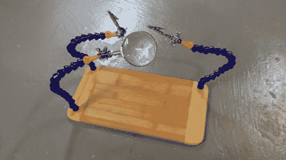

# 冷却液软管夹子将您的部件固定到位

> 原文：<https://hackaday.com/2014/03/03/coolant-hose-grippers-keep-your-components-in-place/>

无论你在处理微小部件时双手颤抖，还是仅仅需要更多的控制和灵活性，我们认为与你可以买到的小金属相比，这种使用冷却液软管的[“第三只手”抓手是一种巧妙的解决方案。](http://eleccelerator.com/improved-third-hand-using-coolant-hose/)

毫不奇怪，这不是一个原始的想法。事实上，Sparkfun 实际上是作为一个套件 出售的。话虽如此……它相当昂贵——尤其是当你能以不到 15 美元的价格打造[弗兰克·赵的]版本时。

他使用了一块砧板、三根机械式冷却液软管和五金店的一些紧固件。你可以使用普通金属[第三只手](http://en.wikipedia.org/wiki/Helping_hand_(tool))的配件，但【Frank】也向我们展示了如何使用几个垫圈、一些钢带和一个蝶形螺母和螺栓来重新制作它们。

[赵先生]对黑客一天也不陌生——我们几乎可以说他是一个无意的贡献者，我们分享了他这么多的黑客！只要看看他的[微型 USB 名片](http://hackaday.com/2010/10/29/tiny-usb-business-card/)，他那令人敬畏的 [LED 怀表](http://hackaday.com/2012/11/30/led-pocket-watch-2/)，[一个详细的回流焊炉构建](http://hackaday.com/2012/01/01/a-very-detailed-reflow-oven-build/)，甚至是他的[基于 IR 的增强现实](http://hackaday.com/2013/03/25/ir-based-augmented-reality/)设置。

[谢谢基思！]