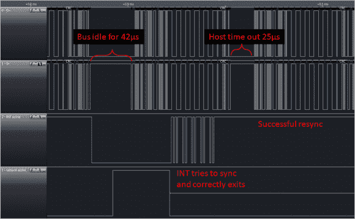

# 无中断 V-USB

> 原文：<https://hackaday.com/2014/03/04/interrupt-free-v-usb/>

[Tim]新版本的 Micronucleus， [Micronucleus 2.0](http://cpldcpu.wordpress.com/2014/03/02/interrupt-free-v-usb/) ，通过消除中断需求，对 V-USB 进行了改进。最初的[微核](http://hackaday.com/2012/10/09/bootloader-brings-usb-firmware-updating-to-the-attiny85/)是 V-USB 的一个非常小的实现，只占用了 2KB。对于 V-USB 来说，不再需要中断是一个巨大的飞跃。

对于那些不知道的人来说，“ [V-USB](http://www.obdev.at/products/vusb/index.html) 是 Atmel 的 AVR 微控制器的低速 USB 设备的纯软件实现，使几乎任何 AVR 微控制器都可以构建 USB 硬件，而不需要任何额外的芯片。”使用 V-USB 的一个棘手的方面是引导装载程序需要中断，这会导致用户程序中出现混乱的问题。通过消除对中断的需求，微核 2.0 通过消除为用户程序修补中断向量的需求，降低了引导装载程序的复杂性。

由于加快 V-USB 数据传输的额外好处，微核 2.0 对于那些基于 V-USB 的[最小嵌入式平台](http://hackaday.com/2014/03/02/software-usb-on-the-stm8/)来说非常令人兴奋。去试试微核 2.0 吧！留下评论，让我们知道你的想法。