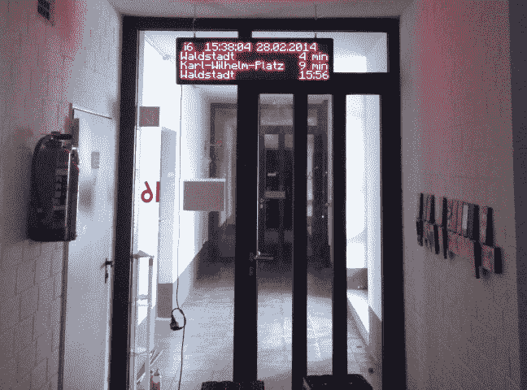

# 公共交通展示

> 原文：<https://hackaday.com/2014/03/04/public-transportation-display/>

[Adrian]和[Obelix]想有一个简单的方法来知道公共交通什么时候到达，所以他们黑了一个 LED 点阵显示器来显示他们宿舍附近车站的到达时间。

他们在易趣上发现显示器带有一个有缺陷的控制器，他们用 ATmega328p 替换了它。他们通过添加一个小的 TP-Link MR3020 路由器，并通过串行线将其连接到 ATmega328p，将显示器连接到互联网。他们当地运输办公室的[网页被轮询以收集感兴趣的站点的等待时间](https://www.db4cl.com/projects/public-transportation-display/)。显示到点阵显示器上的最终图像的所有渲染都是在他们的 PC 上完成的，然后通过 MR3020，Mr 3020 又将其推送到 ATmega328p 进行最终显示。

[Adrian]和[Obelix]警告在显示驱动上设置适当的看门狗定时器，以确保控制器中的错误不会烧坏点阵元素。他们的 ATmega328p 点阵驱动代码可以在【Adrian】的 [GitHub](https://github.com/adrianvielsack/pub/tree/master/ledScreen/avr) 页面上找到。

查看跳跃后显示器运行的视频。

[https://www.youtube.com/embed/3lUiDldbFG8?version=3&rel=1&showsearch=0&showinfo=1&iv_load_policy=1&fs=1&hl=en-US&autohide=2&wmode=transparent](https://www.youtube.com/embed/3lUiDldbFG8?version=3&rel=1&showsearch=0&showinfo=1&iv_load_policy=1&fs=1&hl=en-US&autohide=2&wmode=transparent)