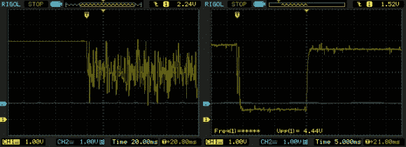

# 用简单的模拟滤波器解决终点挡板问题

> 原文：<https://hackaday.com/2014/03/07/solving-endstop-woes-with-a-simple-analog-filter/>

你知道什么很酷吗？利用你的工程知识解决你在建造过程中遇到的问题。这正是[Reinis]在他的 3D 打印机的[终端停止工作](http://wot.lv/combating-endstop-noise-on-a-reprap.html)时所做的。

当我们遇到传感器问题时，我们许多人会自动去找微控制器，但通常一个简单的 T2 模拟滤波器就能解决问题。[Reinis 的] [RepRap](http://reprap.org/wiki/RepRap) 风格的 3D 打印机在关闭时会发出异常的噪音。当他把 endstop 连接到示波器上时，他震惊地发现实际噪声有多大。接下来是低通滤波器。由于对低通滤波器的响应时间不满意，[Reinis]使用一个上拉电阻解决了这个问题。他只需要两个电阻和一个电容就可以解决这个问题。很棒的解决方案！

您是如何在项目中使用模拟滤波器的？[向我们发送提示](http://hackaday.com/contact-hack-a-day/)并告诉我们！