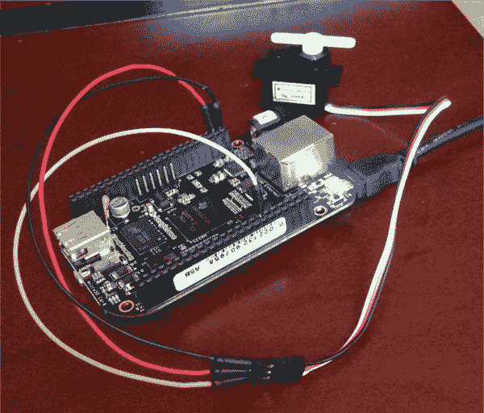

# Web 控制的伺服从一个比格犬骨黑色

> 原文：<https://hackaday.com/2014/03/07/web-controlled-servo-from-a-beaglebone-black/>

[Babak]创建了一个深入的教程，讲述他如何让他的 [BeagleBone Black 从网络浏览器](http://digital-drive.com/?p=136)控制伺服系统。

[Babak]在他的 BeagleBone Black (BBB)上配置了一个引脚作为 PWM 线，并将其连接到微型 hobby 伺服上的控制线。BBB 正在运行 Node.js web 服务器，该服务器显示一个简单的网页来控制伺服。浏览器向同样运行在 BBB 上的小型 WebSocket 节点服务器发送 WebSocket 请求，然后该服务器将适当的 PWM 值写入连接到伺服的引脚。

node WebSocket 服务器和 web 服务器的代码可以在他的 [GitHub 页面](https://github.com/bparvizi/beaglebone-black/tree/master/websocket-client)上找到。还有一个[小节点库](https://github.com/bparvizi/beaglebone-black)用来控制 BBB 上的 PWM 线。虽然最终结果很简单，但控制伺服系统可以从任何可以与 BeagleBone Black 建立网络连接的浏览器进行。查看跳跃后的视频，了解描述和演示。

[https://www.youtube.com/embed/6gv3gWtoBWQ?version=3&rel=1&showsearch=0&showinfo=1&iv_load_policy=1&fs=1&hl=en-US&autohide=2&wmode=transparent](https://www.youtube.com/embed/6gv3gWtoBWQ?version=3&rel=1&showsearch=0&showinfo=1&iv_load_policy=1&fs=1&hl=en-US&autohide=2&wmode=transparent)

[途径 [Adafruit](http://www.adafruit.com/blog/2014/02/18/beaglebone-black-and-pwm-controlling-a-servo-using-html5-javascript-and-node-js-beagleboneblack-txinstruments-beagleboardorg/)