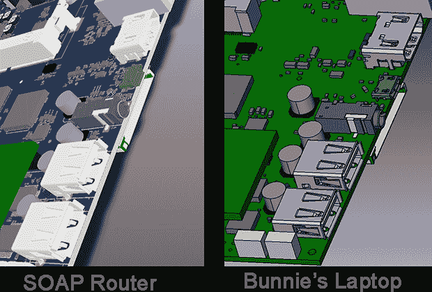
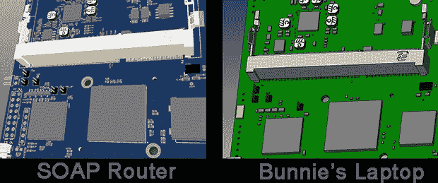
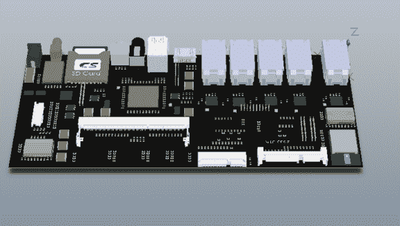

# SOAP:家庭自动化路由器和 Kickstarter 骗局

> 原文：<https://hackaday.com/2014/03/07/soap-the-home-automation-router-and-kickstarter-scam/>

如果一款 7 英寸的平板电脑售价 170 美元，配有四核 ARM Cortex A9 处理器、USB 3.0、32 GB 存储空间、802.11ac、四个千兆局域网端口、蓝牙 4.0、NFC、SATA、HDMI、内置 Zigbee 和 RFID 模块、摄像头、扬声器和麦克风，你会喜欢吗？听起来好得难以置信？那是因为很可能是。来看看带触摸屏的家庭自动化路由器 SOAP，这将成为 Kickstarter 有史以来最大的骗局之一。

已经有[一些散布在网络上的帖子](http://www.reddit.com/r/kickstarter/comments/1zjhvg/warning_soap_router_a_soapy_bubble_of_scam/)讨论了一些关于 SOAP kickstarter 的“不一致之处”，主要集中在虚假的脸书赞和推特粉丝的可能性上。他们的开发过程也存在问题:他们开始用 Arduino 构建路由器，然后转向 Raspberry Pi、Beaglebone、英特尔凌动 Minnowboard、Gizmo Board、PandaBoard 和 Wandboard。如果你一直在跟踪，那至少有六种完全不同的架构被用在他们的开发迭代中。任何曾经试图建造一些东西的人——请注意，甚至没有建造一个产品——都会意识到这里有些东西。这还没有考虑到[一个相当准确的 BOM 细目分类](https://www.kickstarter.com/projects/soaprouter/soap-first-smart-router-w-touch-display-powered-by/comments?cursor=6033963#comment-6033962)，总生产成本为 131 美元。

最确凿的证据来自最终电路板设计的截图。这些照片已经从 Kickstarter 页面[上移除，但是它们仍然在谷歌缓存](http://webcache.googleusercontent.com/search?q=cache:https://www.kickstarter.com/projects/soaprouter/soap-first-smart-router-w-touch-display-powered-by)上。SOAP 团队声称他们正在他们的板上安装 USB 3.0 端口，但照片清楚地显示每个 USB 端口上只有四个引脚。USB 3.0 需要九个引脚。仔细查看后发现这些截图来自 [Novena](http://www.kosagi.com/w/index.php?title=Novena_Main_Page) 、【黄小蓉】的开源笔记本电脑的文件。

其实所有从 Kickstarter 页面删除的主板图片，只要从 Novena 网站下载几个文件[就可以重现。例如:](http://www.kosagi.com/w/index.php?title=Novena_Main_Page)

有一个相当有说服力的论点是 SOAP 硬件并不存在。至少，SOAP 团队试图在没有原型的情况下 Kickstart 硬件，这与 Kickstarter ToS 有些冲突。最坏的情况下，这是一个完全的骗局。

为了公平起见，我会给 SOAP 团队一个自我救赎的机会。尽管[他们不会把任何开发原型送到审查网站](https://www.kickstarter.com/projects/soaprouter/soap-first-smart-router-w-touch-display-powered-by/comments?cursor=6067787#comment-6067786)，我还是愿意拿出我自己的 500 美元去*租*当前版本。交易很简单:把你所有的定制硬件发给我，我会在两天内把它连同一张 500 美元的支票一起寄回来。这个价格包括一个，“这不是一个骗局”的职位。

无论如何，我愿意以这个价格试用[邦尼]的笔记本电脑。

#### 更新

SOAP guys [发布了一个更新](https://www.kickstarter.com/projects/soaprouter/soap-first-smart-router-w-touch-display-powered-by/posts/770379)展示他们的电路板。这不是[邦尼]的笔记本电脑，乍一看，似乎有他们声称的所有端口。

