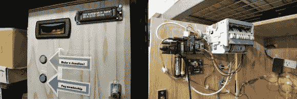

# 自动接受会费或捐款

> 原文：<https://hackaday.com/2014/03/13/automatically-accept-membership-fees-or-donations/>

无论你经营的是俱乐部还是黑客空间，收取会员费和接受捐款都可能是一件痛苦的事情。来自 TokyoHackerspace 的[MRE]提出了解决方案，[一台自动机器可以接受任何路过的人的现金](http://diy-scib.org/blog/now-taking-you-cash)。

即使黑客空间的管理员不在，会员也可以选择捐赠或支付会员费。该界面包括两个按钮、一个 LCD 显示屏、一个放现金的地方和一个打印两张收据的热敏打印机(一张给你，一张直接放回盒子里)。这个建筑中最酷的部分之一是纸币识别器，它可以处理超过 100 种货币(在这种情况下，它被编程为接受日本钞票)。尽管界面很简单，但在这个版本中还是花了很多心思。实时时钟有备用电池，记录所有账目的 EEPROM，以及作为操作大脑的 Arduino。如果你看一下[的项目页面](http://diy-scib.org/Project/ths-membership-box)，那里有很多关于 Arduino 代码、PCB 布局、如何与纸币识别器连接的[等信息！休息后检查机器运行情况。](http://diy-scib.org/blog/membership-box-pulses)

我们很乐意看到钞票验证机用于其他项目。你以前用过或者造过类似的东西吗？

[https://www.youtube.com/embed/Y60HalOQG2g?version=3&rel=1&showsearch=0&showinfo=1&iv_load_policy=1&fs=1&hl=en-US&autohide=2&wmode=transparent](https://www.youtube.com/embed/Y60HalOQG2g?version=3&rel=1&showsearch=0&showinfo=1&iv_load_policy=1&fs=1&hl=en-US&autohide=2&wmode=transparent)

[谢谢詹姆斯]