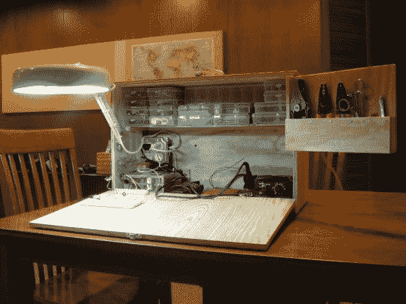

# 另一个令人敬畏的盒子里的电子实验室

> 原文：<https://hackaday.com/2014/03/09/another-awesome-electronics-lab-in-a-box/>

我们打了电话，[布莱恩·兹韦林克]接了电话！这是另一个在盒子里制作[电子实验室的很棒的例子！](http://brianzawesomeblog.blogspot.ca/2014/03/mobile-electronics-workbench.html)

但是首先，到底谁是布莱恩·兹韦林克？他是一个帮助我们赢得 2012 年红牛创造挑战赛的家伙，他为[牛头怪的复仇决斗迷宫建造和编程电路！我们真的需要再做一次这样的事情……你们觉得怎么样？](http://hackaday.com/2012/07/28/the-minotaurs-revenge-dueling-labyrinths/)

无论如何，回到黑客。[Brian 的]版本的[让你的电子实验室在盒子里](http://hackaday.com/2014/03/05/make-your-electronics-lab-in-a-box/)，是相似的，但也是独特的。我们喜欢他的版本是盒子里用于插入工具的电源插座，超级方便的隐藏式放大镜，以及他的盒子的大小；顶层搁板有足够的空间存放组件！他唯一丢失的东西是他的示波器，对盒子来说有点太深了，所以它必须保持独立。

你们觉得怎么样？

[via [Reddit](http://www.reddit.com/r/electronics/comments/1zu9p0/i_got_tired_of_cleaning_my_projects_off_the)