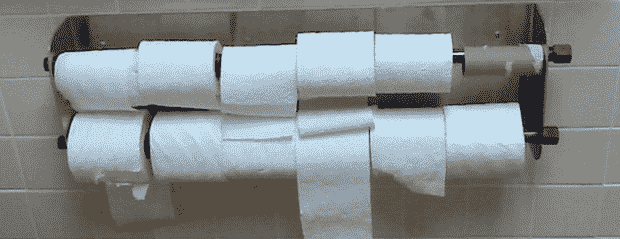

# 问问 Hackaday:用 Arduino 擦屁股？

> 原文：<https://hackaday.com/2014/03/09/ask-hackaday-wiping-your-bum-with-an-arduino/>

过还是过？站着还是坐着？的确，卫生纸是有史以来最不可调和的争论的焦点。Arduino Stack Exchange 上的人有一个更重要的问题:[当 TP 供应不足时，如何触发警报？](http://arduino.stackexchange.com/questions/564/how-to-trigger-an-alarm-when-toilet-paper-is-low)

[user706837]在回答他的孩子从不更换空纸卷时，向互联网提出了这个问题。这消除了通知某人空纸卷的最明显的方式——在你坐下之前看一看——并带来了一些有趣的工程挑战。

大多数最初的想法涉及重量或某种可以区分白色 TP 和棕色卷的光传感器。[一个有趣得多的解决方案](http://arduino.stackexchange.com/a/573)将一个放射源放入 TP 支架的弹簧杆中，并使用一个传感器来检测 TP 还剩多少。一个快速的回溯计算表明这是可能的，而且令人惊讶的是，并不太危险。

我们把这个交给你，黑客读者。你会如何设计一个空卫生纸报警器？因独创性和抗猫性而获得加分。

[图片来源](http://en.wikipedia.org/wiki/Toilet_paper_orientation)，也是有史以来最长最荒谬的维基百科文章之一。