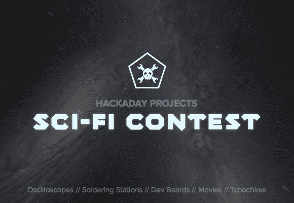

# 科幻竞赛的奖品让你像仇人一样流口水

> 原文：<https://hackaday.com/2014/03/11/sci-fi-contest-prizes-make-you-drool-like-a-rancor/>

我们已经有一段时间没有举办比赛了，现在是时候升级我们的游戏了。你有几周时间[想出最好的科幻主题黑客](http://hackaday.io/page/276)。我们已经积累了许多值得争取的奖项，通过聪明、协作和开放的结合，我们将赢得这场挑战。战利品包括 rad(是的，我们说过了)工具，如示波器、逻辑嗅探器、焊接站和开发板，以及主题产品，如经典科幻电影和来自我们最喜欢的虚构世界的小摆设。

昨天，我们宣布 [Hackaday 项目向公众开放注册](http://hackaday.com/2014/03/10/hackaday-projects-open-to-the-public/),现在我们正在尝试新网站。之前的比赛，如[饰品](http://hackaday.com/2013/11/08/trinket-contest-winners/)和 [Fubarino](http://hackaday.com/2013/12/31/fubarino-contest-winners/) 版本，因为参赛作品的数量太多而变得难以操作。新的界面将使它变得更加容易。我们还想测试协作功能，因此参赛要求之一是作为一个团队参与。获胜者将根据项目的文档化程度、开放程度(如软件和硬件)、与主题的契合程度以及团队的合作程度来挑选。

比赛现在开始，将于 2014 年 4 月 29 日太平洋时间上午 12:00:00 结束(我们知道你们很多人喜欢推延截止日期)。前往竞赛页面查看所有细节。让游戏开始吧！

[ [官方比赛页面](http://hackaday.io/page/276)

【背景[图像来源](http://www.flickr.com/photos/gsfc/7309213060/in/photostream/)