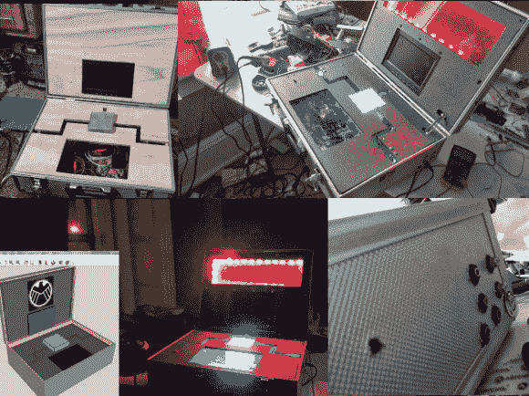

# 道具复制宇宙魔方案件有一些严重的技术在里面

> 原文：<https://hackaday.com/2014/03/12/prop-replica-tesseract-case-has-some-serious-tech-inside/>

[达斯汀·埃文斯]是最近的《复仇者联盟》电影的忠实粉丝——见鬼，我们也是！所以他决定制作这个超棒的宇宙魔方道具复制品！

特瑟-怎么了？一个[宇宙魔方](http://en.wikipedia.org/wiki/Tesseract)或立方体棱柱是一种几何形状，从技术上讲是一个四维超立方体——在《复仇者联盟》的电影中，它是一种极其强大和不稳定的外星能源。

为了制作复制品，[Dustin]从五金店拿了一个便宜的铝制工具箱，进行了一些测量，并开始使用 SketchUp 设计它的内部。他挤在一个 Arduino 里，里面有一个频谱屏蔽，一个 BlueSmirf 蓝牙调制解调器，一个树莓 Pi，一个 7 英寸的 LCD，扬声器和一个 amp，一个用于 Pi 的 WiFi 卡，以及一些新像素。它使用独立版本的 XBMC 运行 Raspbian，这意味着使用 AllCast 他可以从手机或平板电脑无线控制盒子——现在他只差一个可以发出几百万瓦的迷你发电机了！

[https://www.youtube.com/embed/QSgDRsoyuYo?version=3&rel=1&showsearch=0&showinfo=1&iv_load_policy=1&fs=1&hl=en-US&autohide=2&wmode=transparent](https://www.youtube.com/embed/QSgDRsoyuYo?version=3&rel=1&showsearch=0&showinfo=1&iv_load_policy=1&fs=1&hl=en-US&autohide=2&wmode=transparent)

这东西和我们自己的 [雷神之锤会很配！](http://hackaday.com/2013/05/02/high-voltage-thors-hammer-mjolnir-at-80000-volts/)哦——还有一个有趣的花絮——我们的一位作家[实际上是我]设计并建造了一个生产 Rimowa 行李箱的生产车间，这是电影中使用的品牌！