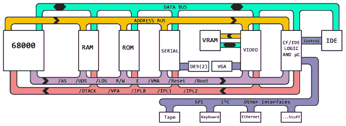
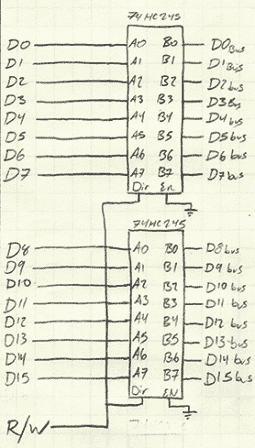
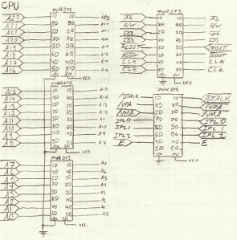
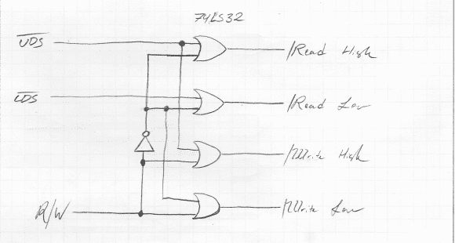
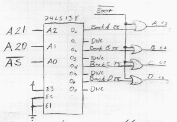

# Hackaday 68k:粘合架构缓冲图

> 原文：<https://hackaday.com/2014/03/13/hackaday-68k-gluing-architecture-buffer-maps/>

 是时候为互联网上最好的项目托管网站的 [Hackaday 项目做更多的广告了。我们告诉过你这是合作吗？你和你的朋友可以一起做项目？想要更多鼓励加入？](http://hackaday.io/)[来一场奖品包括示波器、FPGA 开发板、焊接和返工站、猎兔犬骨、覆盆子和火花核的竞赛](http://hackaday.io/page/276)如何？我的天啊。

哦。我们也在开发一个逆向计算机来展示黑客日项目的特点。这是最新的更新，展示了整个系统的架构，内存映射，逻辑胶和缓冲区。这个项目的计划是让它托管另一个令人敬畏的黑客网站，[我们的复古版本](http://retro.hackaday.com/)，这是主要黑客网站的一个小分支，专门设计为由 1993 年以前建造的计算机加载。最近在 Hackaday tip line 上没有太多复古的成功，所以如果你设法得到一台老式电脑来启动复古网站，拍一张照片并发送出去。

对于那些想了解 Hackaday 68k 项目的人，这里有 [Hackaday 项目页面](http://projects.hackaday.com/project/5-MC68000-Backplane-Computer)，这里有所有[首页更新](http://hackaday.com/tag/hackaday-68k/)。点击“阅读更多…”链接获取更新。

#### 建筑

Hackaday 68k Architecture. Click to embiggen.

架构实际上非常简单；CPU、一吨 RAM、64k ROM 和一对 6850 ACIAs(是的，我知道，但这是有充分理由的……)给了我两个 19.2 kbps 的串行端口。这四个部分是基础系统，可能也是开发中最枯燥的部分。

背板中还会有两到三个显卡，一个紧凑型闪存/IDE 适配器，一个可以与键盘对话的微控制器，一个以太网模块，一个盒式磁带驱动器，可能还有一些我还没有想到的东西。所有这些卡通过四种类型的控制信号连接。地址总线是单向的，从 CPU 卡出来。数据总线是双向的。

还有另外两组控制信号，其中大部分在本项目的最后一篇文章[中有所涉及。注意，这不是我在那篇文章中描述的最小 68000 系统。我将使用中断引脚。因为我使用 6800 外设引脚，这意味着我还需要生成一个 **/DTACK** 信号。这使得该体系结构比我在前面的文章中描述的基本的“你可以在试验板上构建 68k 系统”的计算机更先进一些，但并不多。](http://hackaday.com/2014/03/05/hackaday-68k-blinking-a-led/)

当我接触到视频和 IDE/微控制器板时，真正的乐趣就开始了。这将是一个[雅马哈 V9938 视频显示处理器](http://en.wikipedia.org/wiki/Yamaha_V9938)，它将有一个 VGA 输出，也与 V9958 兼容。它连接了 128kB 的 DRAM，超出了 CPU 的地址空间。

IDE/紧凑型闪存/微控制器卡将为 CF 卡上的大块存储提供控制逻辑，或者如果我感觉非常冒险，可以为老式 IBM microdrives 硬盘驱动器之一提供控制逻辑。IDE 规范是一个 16 位宽的数据总线，所以它直接连接到 CPU。这种板也将有一个 PS/2(或 ADB)键盘端口，一个以太网模块，以及任何其他我可以塞进去的东西。

#### 缓冲

Data Buffers

这里有一个小小的思想实验。将一个 LED 连接到 68k 上的一个地址引脚上，[有点像我在这篇文章](http://hackaday.com/2014/03/05/hackaday-68k-blinking-a-led/)中所做的。它将驱动一个 LED。两个怎么样？当然可以。还有多少？一打？这些发光二极管还要多久才会停止发光？

这就是将 CPU 上的引脚连接到 RAM、ROM、外设、地址解码器和内存逻辑的问题。最终，CPU 将无法驱动所有的引脚。这就是为什么我们需要缓冲器和线路驱动器。

在我闪烁 LED 的上一篇文章中，我使用了一个简单的电路，通过 74HC04 逆变器来驱动 LED。为了驱动所有的地址、数据和控制线，我需要更复杂一点的东西。没有人感到惊讶，这是一个很久以前就解决了的问题。

Address Buffers

对于单向线路，即地址总线，我将使用 74HC373 八路总线驱动器。其中三个专用于地址线，另外两个用于控制信号。

数据线有点复杂。这些线路是双向的，这使得切换有点困难，但也解决了问题。74HC245 是一个*双向*收发器，允许我将 CPU 的数据线连接到一侧，将背板上的数据线连接到另一侧，并用 **R/W** 线切换方向。非常简单，而且是一个(或者两个，技术上讲)芯片解决方案。

#### 胶

在 CPU 可以访问 RAM、ROM、串行端口和我放在这个蓝色小盒子里的所有其他东西之前，还有最后一件事。存储器和外围芯片必须被解码成正确的地址空间。这意味着使用多种多样的逻辑芯片来读写连接到 CPU 的所有东西。

在我解释这一点之前，我要说是的，我可以用 CPLD、GAL 或其他类型的可编程逻辑来实现。当这个项目从绕线背板上下来时，这就是我要做的。对于绕线电路，一切都非常容易修改，理论上，你可以通过查看电线来制作原理图的精确副本。可编程逻辑只是另一个失败点，不管怎样，我用最简单的方法来做这件事。

#### 解码 RAM 和 ROM

一般来说，这个项目中的所有“大”芯片——视频电路、RAM、ROM、通信适配器等等——都有三个引脚需要切换:**芯片选择**、**读**、**写**。当 CPU 访问某些东西时，必须正确选择这些引脚。读写相当容易，选择每一个芯片只需要多一点点。

6502 等人切换芯片上的**读**和**写**引脚的通常方式是简单地将来自 CPU 的**读/写**连接到芯片。当 CPU 正在读取时，此线为高电平，当芯片正在写入时，此线为低电平。68000 有两个额外的引脚用于控制对芯片的访问: **/UDS** 和 **/LDS。**这些引脚分别在读取或写入数据位 8-15 或 0-7 时有效(低电平)。幸运的是，控制逻辑是一个简单的双芯片解决方案:

这是一个四或门和一个反相器，负责读取或写入 RAM、ROM 或其他器件的高(D8-15)或低(D0-7)部分。简单，并且很容易在背板中的多个卡之间复制。

现在有趣的事情。解码。这就像一个有着惊人严格要求的拼图。我需要使用最少的门电路将地址线转换为片选信号，以最小化延迟，但我还需要确保我没有解码到存储器映射中未使用的空间。

RAM 的底部地址空间将从＄000000 到＄3 ffff——整整四兆字节。为此，我采用 3 至 8 线解码器，并将 RAM 芯片连接到 8 路输出中的 4 路。我应该注意到[lennart] [在黑客项目页面上](http://projects.hackaday.com/project/5-MC68000-Backplane-Computer)提出了一个更好的 RAM 解码电路[。谢了。](http://lell.se/hacks/p/adr-decode68000.png)

这个电路将把我的 8 个 RAM 芯片放入$000000 到$3FFFFF 的地址空间，延迟最小，但有一个问题:当 68000 第一次启动时，它在$000000 寻找指令。因为这是 RAM，在那个位置不会有任何指令，计算机会暂停，世界会终结。我需要某种电路来取消选择 RAM，并为最初的几个时钟周期选择 ROM。

这意味着我需要产生一个 **/BOOT** 信号，或者一个在前八个时钟周期有效(低电平)的信号。我用一个 74HC164 串行输入、并行输出移位寄存器来实现，其中一个输出产生 **/BOOT** 。通过将这个信号放在背板上，我可以用一些 NOR 门取消选择 RAM，用 OR 门启用 ROM，并让 CPU 在复位时读取一些指令。

#### 记忆地图

我不妨在这篇文章中回顾一下记忆地图，所以不分先后，我们开始吧:

*   **$000000** 至**$ 3 fffff**–RAM
*   **$FF0000** 至**$ FFFFFF**–ROM
*   从 **$EF0040** 到 **$EF0042** 解码 6850 个 ACIAs。ACIA 1 是偶数，ACIA 2 是奇数。稍后会详细介绍。
*   对于模式 0 和模式 1，V9938 分别位于 **$DF0000** 和 **$DF0001** 。

注意到外围设备的模式了吗？我取地址空间的前八位，并为每个外设改变一位。这简化了解码，因为我可以使用单个 74HC30 八输入与非门作为 RAM，并在地址线上添加单个反相器来解码所有外设。简单、快速、易于修改和在整个系统中复制。这种为系统的每个部分改变前四个地址位中的一个或两个的设置还有另一个好处:就像我在上一篇文章中所做的那样，通过将 led 放在前四个地址位上，很容易判断哪个外设正在被访问。

* * *

这就是这次更新，不幸的是，它很好地描述了这个系统，没有什么可更新的，直到我得到一个 ROM 监视器和串行端口在这个系统上运行。不过，好消息是:[比尔·赫德]，Commodore 128 的创造者，更便宜的 8 位 Commodore，以及通常令人敬畏的 dude 将在下一次更新中出现。

这是系统建设中比较枯燥的部分。不要误会我；让一个最小的系统运行是值得的，但这个项目真正的乐趣将发生在我看到视频电路、IDE 硬盘驱动器、微控制器和所有那些疯狂的外围设备工作的时候。之后，运行操作系统和编译器会更加有趣。实际上，我有一个以前从未有人做过的操作系统的想法，并且仍然只是 BeOS 和 Haiku 操作系统设计师眼中的一个亮点。这可能需要一两年的时间。

后续更新，在此之前，请继续关注 [Hackaday 项目](http://projects.hackaday.com/project/5-MC68000-Backplane-Computer)。