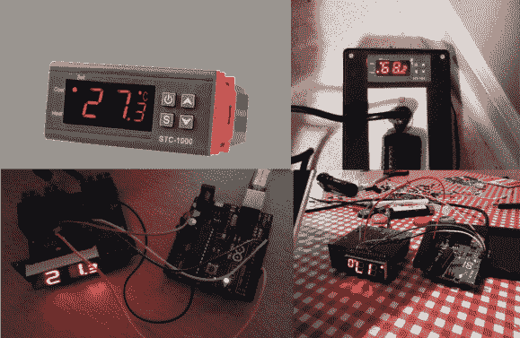

# 温度控制器获得开源固件升级

> 原文：<https://hackaday.com/2014/03/15/temperature-controller-gets-open-source-firmware-upgrade/>

啤酒爱好者欢欣鼓舞！[Mats]已经逆向设计了一个温度控制器，[为其编写了新的开源固件](https://github.com/matsstaff/stc1000p)。这有效地给了所有美国家酿商一个低成本、开源软件驱动的控制器。STC-1000 是远东大量生产的廉价(低于 20 美元)温度控制器。控制器确实可以工作，但是有一些限制。编程选项在某种程度上受限于加热和冷却的基本设定值。控制器也只编程显示摄氏温度，这对于我们这些用华氏温度思考的人来说有点麻烦。在引擎盖下，STC-1000 利用了一个微芯片 PIC16F1828 微控制器。不幸的是，PIC 的保护位被设置，所以原始代码将非常难以提取。这不成问题，因为[Mats]对硬件进行了逆向工程，并编写了自己的固件。10k [NTC 热敏电阻](http://en.wikipedia.org/wiki/Thermistor)作为温度探头。探针由 PIC 的 ADC 读取。这些探头不是非常线性，所以使用查找表将伏特转换为摄氏度或华氏度。

[Mats]新固件允许多达 6 个配置文件。每个配置文件最多有 10 个设定点和保持每个设定点的持续时间。迟滞和温度偏移值也可通过前面板进行编程。PIC 软件通常使用 Microchip 的 MPLAB 工具链用 C 编写，并用 PICkit 3 在线串行编程(ICSP)工具编程。[Mats]决定反抗这个系统，用小型设备 C 编译器编写了他的 C 代码。为了让那些可能没有微芯片工具的自制程序变得简单，[Mats]使用 Arduino Uno 来执行闪存任务。谢天谢地，PIC 和 AVR 的邪恶联姻还没有造成时间和空间的裂痕。固件仍然处于测试阶段，所以如果你想帮忙，[可以加入自制软件论坛](http://www.homebrewtalk.com/f51/stc-1000-a-464348/)的讨论。如果你看到[Mats]告诉他我们欠他一个[Haduino](http://hackaday.com/haduino/)，他可以用它来打开他的啤酒。

【谢谢提示帕克！]