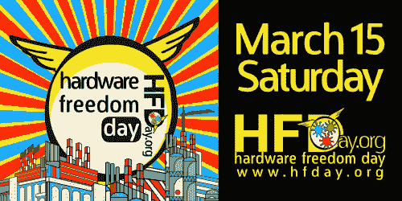

# 你的周末计划:硬件自由日

> 原文：<https://hackaday.com/2014/03/14/your-weekend-plans-hardware-freedom-day/>

[硬件自由日](http://www.hfday.org/)是明天:2014 年 3 月 15 日星期六。这是该活动的第三年，旨在提高对什么是开放硬件的认识，并鼓励黑客和制造商与世界分享他们自己的工作。

这是我们在 Hackaday 坚信的一个概念。支持开放硬件有许多原因。我们通常从两个角度来看:教育和用户自由。如果你的项目设计是可用的，其他人可以从你的成功中学习，并产生更酷的东西，反过来应该是开放的。与此同时，如果你有一个几乎令人敬畏的设备，如果原始设计可以作为参考，一个熟练的黑客将更容易得到它。

如果你想知道你附近发生了什么，每个大洲都有[事件](http://www.hfday.org/map/index.php?year=2014)(除了南极洲……太逊了！).如果大陆相邻关系不够紧密，可以考虑组织一次特别的活动，或者只是回顾一下你去年完成的项目，然后把文件发布给其他人使用。