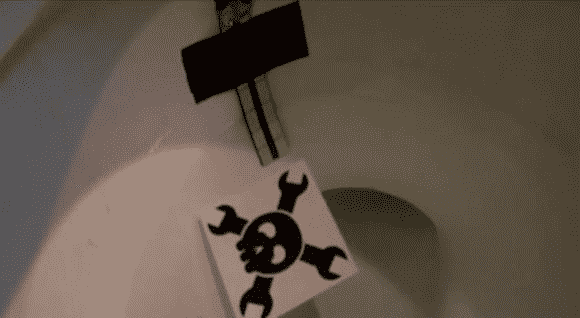

# 我们要了一个 Arduino 肠道测量仪

> 原文：<https://hackaday.com/2014/03/18/we-asked-for-it-an-arduino-bowel-gauge/>

嗯，我们要了，然后[电视米勒]送来了这个令人捧腹又惊人准确的[肠道测量仪](http://tvmiller.com/index.php?entry=entry140316-170734)。

在我们最近用 Arduino 功能擦屁股的[和如何](http://hackaday.com/2014/03/09/ask-hackaday-wiping-your-bum-with-an-arduino/)[测量便便以获得更好的卫生服务的](http://hackaday.com/2014/03/14/measuring-poop-for-a-better-sanitation-service/)之间，我们想我们应该已经看到了这一点。你知道吗？挺牛逼的。

他正在使用一台带有自制电阻传感器的 Arduino Uno 来“侵入我们的肠道”。毕竟，如果你不知道自己到底在吃什么，你怎么能有一个合适的饮食呢？两条铜带或铝带与几个已知的电阻、一个电容和一个用于调节的电位计组成电阻传感器。他甚至还包括一个液晶显示器，这样你就可以实时看到你的粪便量！经典。

为了看到它的动作(不要担心，不是那种的动作),请观看下面的视频:

[https://www.youtube.com/embed/Yuel-Pumrcc?version=3&rel=1&showsearch=0&showinfo=1&iv_load_policy=1&fs=1&hl=en-US&autohide=2&wmode=transparent](https://www.youtube.com/embed/Yuel-Pumrcc?version=3&rel=1&showsearch=0&showinfo=1&iv_load_policy=1&fs=1&hl=en-US&autohide=2&wmode=transparent)

我们特别喜欢使用我们的标志:

> HackADay“骷髅头和扳手”标志经 HackADay.com 许可使用

我们会让它滑…这一次。他还包括代码，你知道，如果你对这种事情很认真的话。