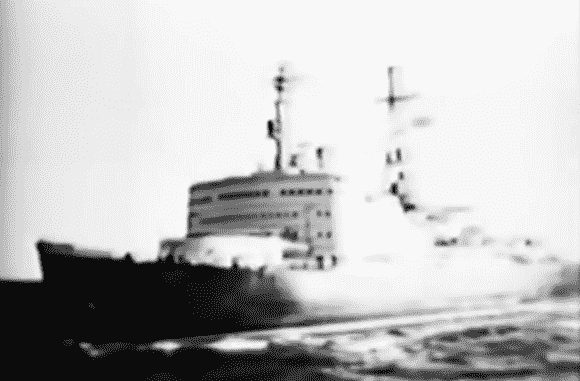

# 逆向技术:打破原子来打破坚冰

> 原文：<https://hackaday.com/2014/03/18/retrotechtacular-breaking-atoms-to-break-the-ice/>

这部 1959 年的纪录片给了[一艘名为*列宁*的核动力破冰船](https://www.youtube.com/watch?v=0Ksa6UA7I7o)内部令人满意的全面观察。这实际上创造了几个世界第一:它是第一艘核动力水面舰艇，也是第一艘以此为动力的民用舰艇。

这艘船是为了清理通往俄罗斯北部港口的航道而建造的。对冰和船舶设计模型的测试表明，它们有能力打破两米厚的冰层。这需要很大的动力，因为破冰船通常利用它们的船体形状和重力来破冰，方法是驶上破冰船，将冰弯曲到断裂点。列宁号利用核反应堆加热蒸汽来驱动发电机，从而获得了这种能量。产生的能量驱动三个螺旋桨为船只提供动力。

当然，这是在控制面板还很大的时候，你可以在这部 20 分钟的电影中途瞥一眼。这包括展示船上的辐射传感器网络，这些传感器向控制室发出警报，并在它们被触发时发出本地警报。在其 30 年的使用寿命中，该船因加油操作发生过几次事故。你可以在维基百科页面找到更多关于[的信息，但是在跳转之后，请继续关注我们，观看复古卷轴。](http://en.wikipedia.org/wiki/Lenin_(nuclear_icebreaker))

[https://www.youtube.com/embed/0Ksa6UA7I7o?version=3&rel=1&showsearch=0&showinfo=1&iv_load_policy=1&fs=1&hl=en-US&autohide=2&wmode=transparent](https://www.youtube.com/embed/0Ksa6UA7I7o?version=3&rel=1&showsearch=0&showinfo=1&iv_load_policy=1&fs=1&hl=en-US&autohide=2&wmode=transparent)

[通过[英俄](http://englishrussia.com/2014/02/21/soviet-atomic-flagship/)(可能是 NSFW)感谢 CNK]

Retrotechtacular 是一个每周专栏，以旧时的黑客、技术和媚俗为特色。通过[发送您对未来分期付款的想法](mailto:tips@hackaday.com?Subject=[Retrotechtacular])，帮助保持新鲜感。