# Hackaday 参观 NOVA 实验室和小批量装配

> 原文：<https://hackaday.com/2014/03/21/hackaday-visits-nova-labs-and-small-batch-assembly/>

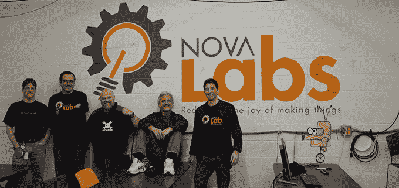

几天前，Hackaday 参观了 NOVA Labs，这是 DC 华盛顿州最大的黑客空间之一。[在我们的视频之旅](http://www.youtube.com/watch?v=kORxL3V1MZ4)中，联合创始人【贾斯汀·勒托】展示了这个空间，浏览了他的空间多年来汇集的所有令人敬畏的工具、工作空间和项目。

NOVA Labs 最令人印象深刻的部分之一是数量惊人的木工设备。从 Blacktoe CNC 路由器、工作台和带锯、接合机、刨床、真正的木工工作台，以及足够将任何东西固定在一起的夹子，所有东西都来自一名 NOVA 成员，他将自己的设备放在一起，供其他黑客空间共享。

除了木工工具，NOVA 还拥有一些激光切割机和足够的 3D 打印机，用于你能想象到的所有八足动物和尤达头颅。一些成员组合了 3D 构建类，正在构建的机器非常非常酷。在他们的最新作品中，他们使用了一个带有 [OctoPrint](http://octoprint.org/) 的 Raspi，在框架上安装了一个摄像头，并使用平板电脑作为界面。这是在不使用电脑的情况下，最平滑、最干净的 3D 打印机界面。

在 NOVA 有很多很酷的事情发生；DC 地区无人机用户群是该地区最大的不在五边形建筑中的无人驾驶飞行器群体，他们已经为即将取代黑客空间的地铁站做了一些空中测绘。上周末，NOVA】还举办了一个小型创客集会，有超过 4000 人参加。至少可以说，令人印象深刻。

NOVA Labs 还有一个由[Bob Coggeshall]领导的小企业，他也是 sudo 的作者之一。这是[的小批量组装](http://www.smallbatchassembly.com/)，这是一项非常酷的服务，将面板化的印刷电路板和元件卷轴组装起来。当我们在那里的时候，[鲍勃]正在为 [R2D2 建筑者俱乐部](http://astromech.net/)组装几十块塞满 WS2812 LEDs 的电路板。

[Bob]正在使用一台非常酷而且非常昂贵的 Manncorp 拾放机来放置所有元件，将锡膏刮过他在 NOVA Labs 机器上激光切割的 Kapton 薄膜。这只是一个小规模的操作，但当涉及到为几十块电路板放置数千个 SMD 元件时，可能没有更好的方法了。

你可以看看 NOVA 的视频，小批量组装，下面还有一大堆图片。

[https://www.youtube.com/embed/_I7FWcrG26A?version=3&rel=1&showsearch=0&showinfo=1&iv_load_policy=1&fs=1&hl=en-US&autohide=2&wmode=transparent](https://www.youtube.com/embed/_I7FWcrG26A?version=3&rel=1&showsearch=0&showinfo=1&iv_load_policy=1&fs=1&hl=en-US&autohide=2&wmode=transparent)

[https://www.youtube.com/embed/kORxL3V1MZ4?version=3&rel=1&showsearch=0&showinfo=1&iv_load_policy=1&fs=1&hl=en-US&autohide=2&wmode=transparent](https://www.youtube.com/embed/kORxL3V1MZ4?version=3&rel=1&showsearch=0&showinfo=1&iv_load_policy=1&fs=1&hl=en-US&autohide=2&wmode=transparent)

   [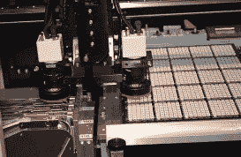](https://i0.wp.com/hackaday.com/wp-content/uploads/2014/03/25.jpg?ssl=1)  [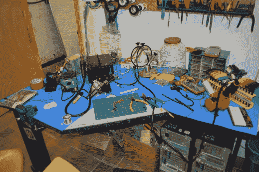](https://i0.wp.com/hackaday.com/wp-content/uploads/2014/03/8.jpg?ssl=1)  [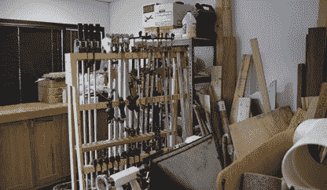](https://i0.wp.com/hackaday.com/wp-content/uploads/2014/03/31.jpg?ssl=1)  [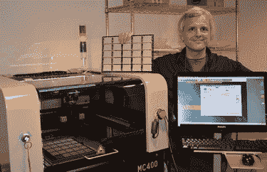](https://i0.wp.com/hackaday.com/wp-content/uploads/2014/03/27.jpg?ssl=1)  [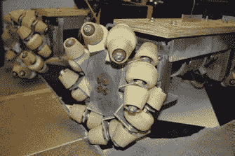](https://i0.wp.com/hackaday.com/wp-content/uploads/2014/03/10.jpg?ssl=1)  [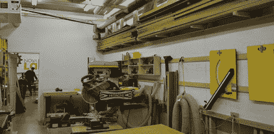](https://i0.wp.com/hackaday.com/wp-content/uploads/2014/03/32.jpg?ssl=1)  [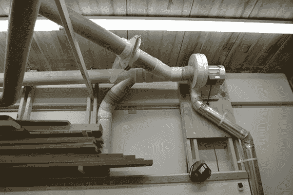](https://i0.wp.com/hackaday.com/wp-content/uploads/2014/03/6.jpg?ssl=1)  [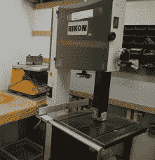](https://i0.wp.com/hackaday.com/wp-content/uploads/2014/03/2.jpg?ssl=1)    [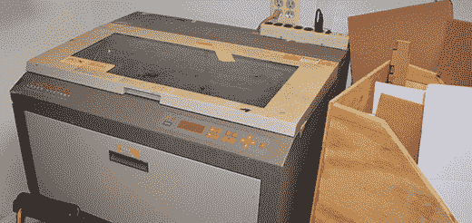](https://i0.wp.com/hackaday.com/wp-content/uploads/2014/03/22.jpg?ssl=1)  [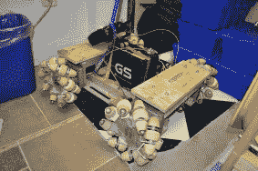](https://i0.wp.com/hackaday.com/wp-content/uploads/2014/03/9.jpg?ssl=1)  [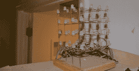](https://i0.wp.com/hackaday.com/wp-content/uploads/2014/03/17.jpg?ssl=1)  [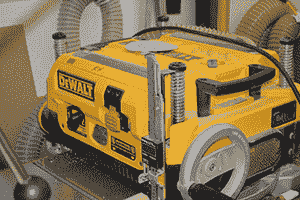](https://i0.wp.com/hackaday.com/wp-content/uploads/2014/03/3.jpg?ssl=1)  [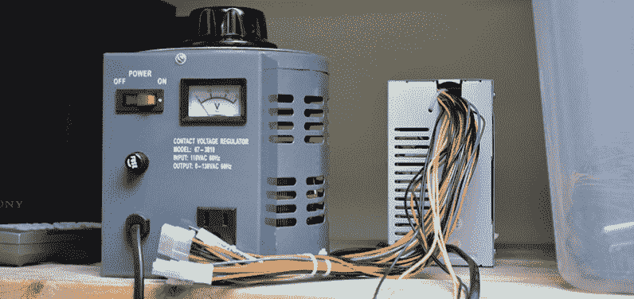](https://i0.wp.com/hackaday.com/wp-content/uploads/2014/03/12.jpg?ssl=1)  [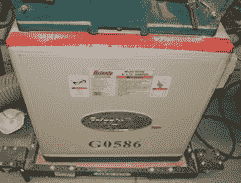](https://i0.wp.com/hackaday.com/wp-content/uploads/2014/03/71.jpg?ssl=1)  [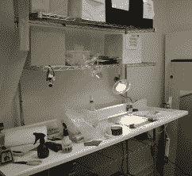](https://i0.wp.com/hackaday.com/wp-content/uploads/2014/03/29.jpg?ssl=1)  [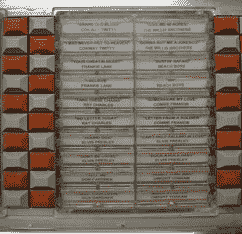](https://i0.wp.com/hackaday.com/wp-content/uploads/2014/03/23.jpg?ssl=1)  [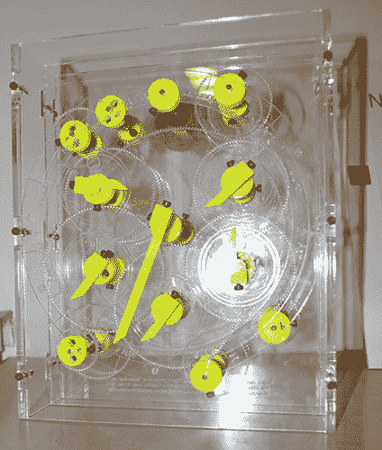](https://i0.wp.com/hackaday.com/wp-content/uploads/2014/03/16.jpg?ssl=1)  [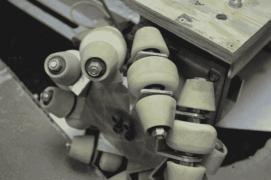](https://i0.wp.com/hackaday.com/wp-content/uploads/2014/03/11.jpg?ssl=1)  [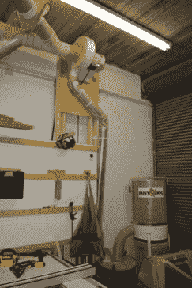](https://i0.wp.com/hackaday.com/wp-content/uploads/2014/03/5.jpg?ssl=1)    [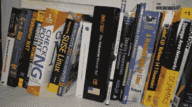](https://i0.wp.com/hackaday.com/wp-content/uploads/2014/03/18.jpg?ssl=1)    [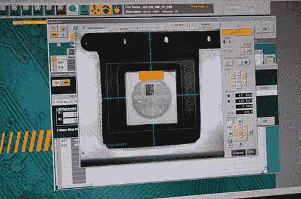](https://i0.wp.com/hackaday.com/wp-content/uploads/2014/03/24.jpg?ssl=1)  [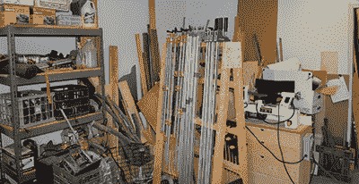](https://i0.wp.com/hackaday.com/wp-content/uploads/2014/03/30.jpg?ssl=1)  [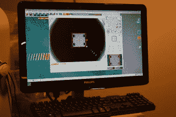](https://i0.wp.com/hackaday.com/wp-content/uploads/2014/03/26.jpg?ssl=1)  [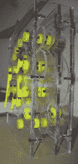](https://i0.wp.com/hackaday.com/wp-content/uploads/2014/03/15.jpg?ssl=1)  [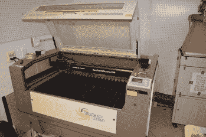](https://i0.wp.com/hackaday.com/wp-content/uploads/2014/03/21.jpg?ssl=1)  [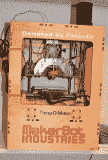](https://i0.wp.com/hackaday.com/wp-content/uploads/2014/03/666.jpg?ssl=1)    [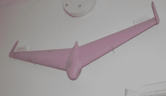](https://i0.wp.com/hackaday.com/wp-content/uploads/2014/03/14.jpg?ssl=1)  [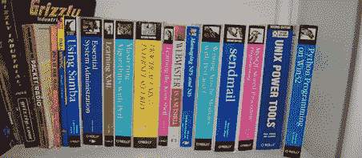](https://i0.wp.com/hackaday.com/wp-content/uploads/2014/03/20.jpg?ssl=1)