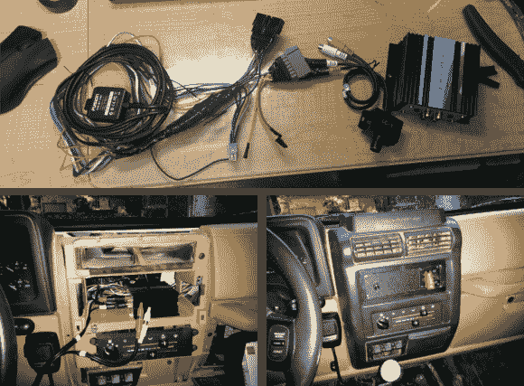

# 隐形蓝牙音响:这是吉普车的东西

> 原文：<https://hackaday.com/2014/03/21/stealth-bluetooth-stereo-its-a-jeep-thing/>

[Feueru]想更新他 1998 年吉普牧马人的音响系统。问题是软顶吉普车因无线电盗窃而臭名昭著。他的解决方案是[制造自己的隐形蓝牙音响](http://imgur.com/a/BTNFd)。音乐通过蓝牙来自他的 Nexus 5。一个融合的 MS-BT 100 防水蓝牙接收器拾取曲调。从那里，信号通过一个外部控制，线电平音量旋钮。一个“BMWx-43 300 瓦”放大器为吉普车的扬声器提供驱动电源。我们有点怀疑 300 瓦的额定功率，以及“只来自德国人的头脑”这句口头禅。嘿，至少[真正的宝马](http://www.bmw.com/com/en/)没有因为商标问题在美国港口销毁[的放大器。](http://hackaday.com/2014/03/20/fluke-issues-statement-regarding-sparkfuns-impounded-multimeters/)

[Feueru]为他的吉普车使用了标准 DIN 无线电安装套件。他用 ABS 塑料片代替了耳机。ABS 提供了一个安装音量控制器的好地方。那个音量旋钮有点孤单，所以[Feueru]增加了“B 计划”，他的绞盘控制。最终的结果看起来…嗯，它看起来像一个旋钮，这正是[弗鲁]想要的。任何想偷汽车收音机的人都会忽略这一点。唯一缺少的是一个真正的调频接收器。当然，使用蓝牙音频路径时会有一些损失。然而，这是一个软顶吉普与股票扬声器，所以它真的没有注意到[Feueru]。

[via [reddit](http://www.reddit.com/r/DIY/comments/20wyku/my_stealth_bluetooth_car_stereo_with_no_head_unit/)