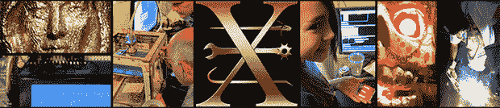

# 黑客空间之旅:亚利桑那州图森的 Xerocraft

> 原文：<https://hackaday.com/2014/03/22/hackerspace-tour-xerocraft-in-tucson-arizona/>

虽然我们试图去尽可能多的黑客空间，但我们不可能无处不在。亚利桑那州图森市 Xerocraft 的人们不想等待一个懒散的同胞走过他们尘土飞扬的城镇，他们发送了自己的太空视频旅行。

几年前，当[Caleb]在他的西南之旅中穿过城镇时，我们已经在之前看到了[xero craft 空间。从那以后，很多事情都变了；他们有一个新的、更大的、更干净的空间，在旧空间以北几英里处。工具的数量也有了巨大的增长。虽然旧空间拥有所有常见的金属加工工具，但新空间有一个改善很多的木材店和更多的 3D 打印机。](http://hackaday.com/2012/08/12/southwest-tour-xerocraft-in-tucson-arizona/)

从视频来看，这看起来是一个很棒的空间，从他们的博客来看，他们似乎已经有了一些非常酷的项目。如果你是黑客空间的成员，我们总是在寻找一些旅游视频。请务必[将它们发送到](http://hackaday.com/contact-hack-a-day/)，这样你就可以与其他黑客读者分享你的空间。

[https://www.youtube.com/embed/2GhRCL1eLWw?version=3&rel=1&showsearch=0&showinfo=1&iv_load_policy=1&fs=1&hl=en-US&autohide=2&wmode=transparent](https://www.youtube.com/embed/2GhRCL1eLWw?version=3&rel=1&showsearch=0&showinfo=1&iv_load_policy=1&fs=1&hl=en-US&autohide=2&wmode=transparent)