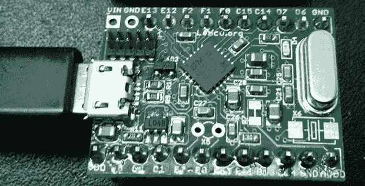

# 低功耗 arm 上的位碰撞 USB

> 原文：<https://hackaday.com/2014/03/22/bitbanging-usb-on-low-power-arms/>

通过 Adafruit 小饰品、Digispark 以及 Atmel 提供的最小微控制器的一些非常聪明的工作，嵌入式软件开发人员似乎应该在不支持 USB 协议的硬件上对 USB 协议进行 bitbang。有很多非常小的 ARM 芯片没有 USB 支持，所以有人能够在 ARM Cortex M0+ 上使用 USB 只是时间问题。

上面的主板基于 Energy Micro EFM32ZG，这是一款非常小的 24 引脚 QFN 器件，具有高达 32 kB 的闪存和 17 个 GPIOs。与所有的 bitbanged USB hacks 一样，差分数据线直接连接到微控制器。需要一个 24 MHz 的晶体，但项目背后的团队正致力于使用内部 RC 振荡器。

代码是可移植的，其他制造商的 Cortex M0+芯片之间的变化很小，只需一点点工作，这可以成为一个非常非常便宜的 USB 可编程 ARM 开发板，社区肯定可以使用。