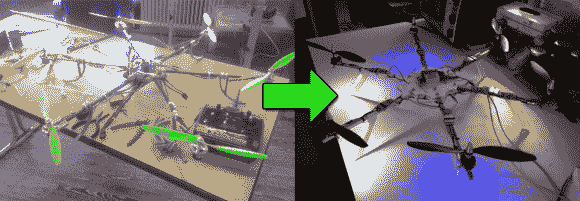

# FPV 的六轴直升机

> 原文：<https://hackaday.com/2014/03/23/a-hexacopter-with-fpv/>

[Robert]在过去的两年里一直努力成为一名六旋翼直升机专家，自从他第一次点击 Hobbyking 上的“购买”按钮以来，他已经提供了一个回顾他的多旋翼建造经历的[。他已经从他的第一个建筑走了很长的路，他的第一个建筑使用廉价的碳棒和 3D 打印部件作为框架，由废木头和热胶水支撑。它在他的车里结束了；暴露在阳光直射下，3D 打印的组件熔化了。](http://armageddon421.de/?p=297)

最新的迭代——见上图右侧——是一个完整的重新设计，激光切割的框架大大减轻了整体重量，新的“驴”马达摆脱了颠簸。它足够强壮，可以举起一个吊在绳子上的 1.6 公斤(3.5 磅)的毛绒动物玩具！最近，[罗伯特]通过 3D 打印附件将相机安装到 hexacopter 上，并将体验与[蔡司 Cinemizer 3D 眼镜](http://cinemizer.zeiss.com/cinemizer-oled/en_de/home.html)配对后，开发出了第一人称视频流。他仍然有一些问题要解决，即螺丝因振动而松动，并在显示屏上添加一个 HUD，这样他就可以知道电池电量何时低。休息之后，你可以看到可怜的泰迪熊和其他一些视频一起被绞死，包括第一人称视频飞行。

[https://www.youtube.com/embed/4b-qJ3y1zzA?version=3&rel=1&showsearch=0&showinfo=1&iv_load_policy=1&fs=1&hl=en-US&autohide=2&wmode=transparent](https://www.youtube.com/embed/4b-qJ3y1zzA?version=3&rel=1&showsearch=0&showinfo=1&iv_load_policy=1&fs=1&hl=en-US&autohide=2&wmode=transparent)

[https://www.youtube.com/embed/38-bgYxTeXY?version=3&rel=1&showsearch=0&showinfo=1&iv_load_policy=1&fs=1&hl=en-US&autohide=2&wmode=transparent](https://www.youtube.com/embed/38-bgYxTeXY?version=3&rel=1&showsearch=0&showinfo=1&iv_load_policy=1&fs=1&hl=en-US&autohide=2&wmode=transparent)

[https://www.youtube.com/embed/H27SDXf3hEc?version=3&rel=1&showsearch=0&showinfo=1&iv_load_policy=1&fs=1&hl=en-US&autohide=2&wmode=transparent](https://www.youtube.com/embed/H27SDXf3hEc?version=3&rel=1&showsearch=0&showinfo=1&iv_load_policy=1&fs=1&hl=en-US&autohide=2&wmode=transparent)