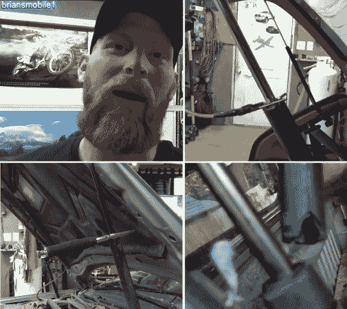

# 3 个便宜的引擎盖/掀背车/礼帽模块来拯救你的脑袋

> 原文：<https://hackaday.com/2014/03/24/3-cheap-hoodhatchbacktopper-mods-to-save-your-noggin/>

这与其说是一个黑客，不如说是一个 mod，但是任何时候你都可以改变原始设备以保持其可用性，这对你和环境都是一个双赢的局面。每个人都有或认识有车的人，现在大多数车辆都有某种类型的掀背车或引擎盖，其支撑解决方案是充气支柱。不可避免的是，这些充气支柱会随着年龄的增长而失效，并且在更热或更冷的气候下会加速失效。如果你曾经不得不更换这些物品，你知道它们的价格最低为 20 美元，最高可达 60 美元。大多数车辆需要两个、四个甚至八个这种昂贵的小装置。

[Brian]来自 Briansmobile1 YouTube 频道，记录了三种简单且低成本的解决方案。我们可能都知道[老虎钳解决方案](http://www.youtube.com/watch?v=PzSiUM2gRis)，但这是一种笨重且昂贵的解决方案，并不总是非常方便或快速。另一个解决方案是[以一种特殊的方式](http://www.youtube.com/watch?v=77XuANHuNq0)切下一根橡胶软管，这样就可以很容易地穿上和脱下轴，并悬挂在一根绳子上，所以它总是可用的。[的最佳解决方案是使用一个也连接到绳子或电线的栓销](http://www.youtube.com/watch?&v=5FMKAFiVt4g)。为了使挂钩销工作，您必须在提升轴的任意一侧的正确位置磨出几个凹口，以便销可以咬合，并防止轴在您选择的高度缩回。

我们确信这些解决方案在大多数人的驾驶生涯中都会派上用场。休息之后，我们将链接到所有三个[Brian]关于气体支柱修复解决方案的便捷视频。如果你自己做汽车维修，我们绝对可以推荐[【Brian’s】频道的 600 多个汽车维修和保养视频](http://www.youtube.com/user/briansmobile1)，这些视频通常带有一定的哲理和幽默。

栓销
[https://www.youtube.com/embed/5FMKAFiVt4g?version=3&rel=1&showsearch=0&showinfo=1&iv_load_policy=1&fs=1&hl=en-US&autohide=2&wmode=transparent](https://www.youtube.com/embed/5FMKAFiVt4g?version=3&rel=1&showsearch=0&showinfo=1&iv_load_policy=1&fs=1&hl=en-US&autohide=2&wmode=transparent)

软管
[https://www.youtube.com/embed/77XuANHuNq0?version=3&rel=1&showsearch=0&showinfo=1&iv_load_policy=1&fs=1&hl=en-US&autohide=2&wmode=transparent](https://www.youtube.com/embed/77XuANHuNq0?version=3&rel=1&showsearch=0&showinfo=1&iv_load_policy=1&fs=1&hl=en-US&autohide=2&wmode=transparent)

虎钳夹
[https://www.youtube.com/embed/PzSiUM2gRis?version=3&rel=1&showsearch=0&showinfo=1&iv_load_policy=1&fs=1&hl=en-US&autohide=2&wmode=transparent](https://www.youtube.com/embed/PzSiUM2gRis?version=3&rel=1&showsearch=0&showinfo=1&iv_load_policy=1&fs=1&hl=en-US&autohide=2&wmode=transparent)