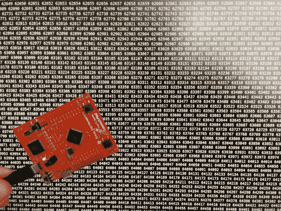

# 厄拉多塞的嵌入式筛子:手臂上的狩猎素数

> 原文：<https://hackaday.com/2014/03/24/embeded-sieve-of-eratosthenes-hunting-primes-on-arm/>

最后，我在周末有足够的时间完成一个快速项目。我在 ARM 芯片上实现了[厄拉多塞筛。](http://hackaday.io/project/577-Embeded-Sieve-of-Eratosthenes)

如果你没有听说过厄拉多塞的筛子，那么你真的需要通过 T2 的欧拉项目来了解一下。那是我第一次知道这种寻找质数的方法的地方。你从所有数字的列表开始，找到一个质数，然后从列表中删除该质数的所有倍数。在微控制器上做这件事的真正诀窍是如何在有限的空间里存储大量的数字。我的方法的要点是使用布尔数组(我称之为位打包数组，但这可能是错误的说法)。细节可以在我的项目中找到，链接在顶部。

“为什么，”在这里问这个问题几乎总是不对的。但在这种情况下，我这样做是因为我想尝试一下 ARM 内核的位绑定功能。这些芯片的别名地址映射到 SRAM 和一些外设寄存器中的单个位。这允许使用单个指令对单个位进行读或写访问。原来 32 位架构的一个副作用是有地址烧。