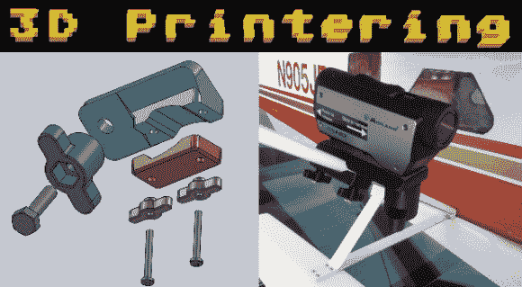
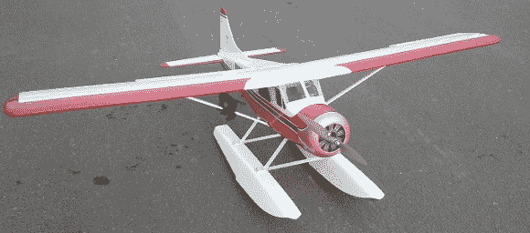
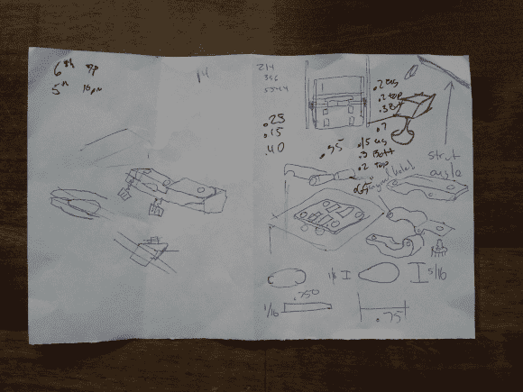
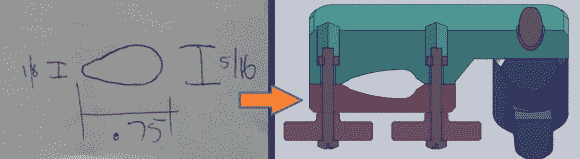
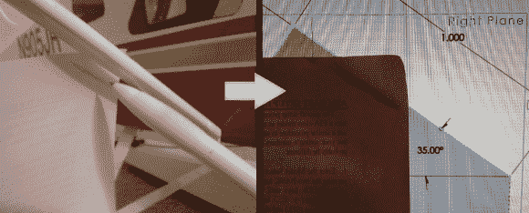
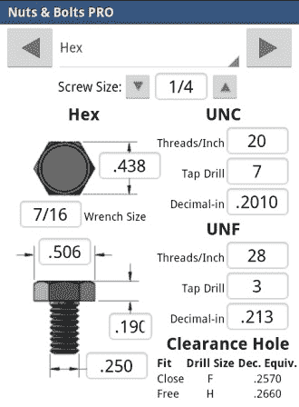
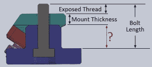

# 3D 打印:定制遥控摄像机安装到天空

> 原文：<https://hackaday.com/2014/03/26/3d-printering-custom-rc-camera-mount-takes-to-the-sky/>



3D 打印机只擅长打印[小饰品和小摆设](http://hackaday.com/2014/03/19/3d-printers-can-only-make-trinkets-what-about-kayaks/)，对吧？不完全是。虽然，我偶尔会打印一些无用的东西，但我的大部分打印作品都是用于我正在进行的项目或者满足我的需求。这些需求是项目的设计要求，我想分享我在创建一个功能性 3D 对象时使用的过程和技术。

我的朋友(Toshi)有遥控飞机，经常飞行。我有一个从未用过的动作相机。为什么不把两者结合起来，找点乐子呢？唯一阻碍我们的是将相机安装到飞机上的方法。3D 打印让它变得简单。如果你有一个受欢迎的车辆或应用程序，可能在 3D 模型库中已经有一些可用的东西，如 [Thingiverse](http://www.thingiverse.com) 。我们的情况相当独特，我决定设计和印刷我自己的坐骑。



让我们从摄像头的位置开始。看着飞机，有两个非常明显的地方是安装相机的好地方；在机翼支柱或浮筒之间的横杆上。当然，将相机安装在矩形浮筒横杆上会比安装在有角度的翼型机翼支柱上容易得多，但经过一番思考后，安装在支柱上会给飞机带来更好的视野。我想在视野中看到飞机的一部分。

现在我们有了这个东西要安装在哪里的想法，我们必须进行一些测量，并做一些记录。正如你在下面看到的，我的笔记非常粗糙(可能有一些多余的涂鸦)，但有我需要设计相机支架的必要信息。如果你仔细看，你甚至可以看到我有几个头脑风暴的安装想法，包括一个铰链设计，我认为这是不必要的复杂。



机翼支柱是柔软的泡沫填充塑料，呈泪珠状。为了防止安装摄像机时损坏支柱，夹具配合部分的形状应该相似。为了做到这一点，我只是测量了支柱轮廓的长度以及前缘和后缘的厚度。在夹具中创建切口轮廓时，会用到这些尺寸。注意，我还在切口的前沿和后沿添加了一些倒角，以防止任何潜在的挤压。



简单点，笨蛋。有时候低技术含量是最好的选择。机翼支柱在某个角度，一个我不知道的角度。我希望相机垂直于地面，而不是像支柱那样倾斜。我使用了一种类似于[层](http://en.wikipedia.org/wiki/Storey_pole)杆的方法来记录支柱角度，并在我的建模软件中模拟它。飞机放在地板上，拿着一张纸，纸的一边也垂直于地板。支柱的角度被画在纸上。在这一点上，可以用量角器来测量角度，但我只是把它举到我的电脑屏幕前，调整支架的角度，直到它符合我的轨迹。科技含量低但有效。


相机底部有一个 1/4 英寸-20 英寸的内螺纹用于安装到支架上是很标准的。我的相机也不例外。主支架上有一个通孔，以便连接螺钉穿过。具有 1/4”的孔和 1/4”的螺钉将导致一些组装困难，特别是螺钉不容易穿过孔，不能自由转动或导致未对准。这种情况有行业标准，谷歌“间隙孔尺寸”来找出什么是适合你的螺丝尺寸，有很多[图表](http://littlemachineshop.com/Reference/tapdrill.php)可用。我从事的项目需要我经常参考这种类型的信息，所以我下载了一个很棒的应用程序，名为“[螺母&螺栓](https://play.google.com/store/apps/details?id=com.botnerd.android.nutsandbolts)”。请注意，在屏幕的右下方显示了间隙孔的尺寸。我将使用免费安装推荐，0.2660 英寸直径。

我可以在主相机支架上开一个洞，拧上一个螺栓来固定它，但设计要求是安装或拆卸不需要任何工具。3D 打印的旋钮就可以了。我有一些 1 英寸长的 1/4”-20 螺栓踢来踢去，所以这就是我决定使用。由于螺栓太长，在将相机固定到底座之前，它会在相机中降到最低点。当设计旋钮时，必须补偿额外的长度。

相机底部的内螺纹孔的深度测量为 0.200 英寸。因为目的是在相机固定之前不要将螺丝降到最低点，所以我将测量值降低到 0.150 英寸，以便在计算中使用:

```
BoltLength - ExposedThread - MountThickness = KnobThickness
 1.0 - 0.150 - 0.300 = 0.550 inches
```

0.550 英寸是旋钮的间隔部分的长度。


有两个旋钮和 3 毫米 x 25mm 毫米的螺钉，用于将相机支架固定到支柱上。我为螺丝做了旋钮，就像我为主相机螺丝做的一样。主要区别在于，这些螺钉没有六角头来传递扭矩和防止旋钮在螺钉上旋转。旋钮上的孔直径为 3 毫米，没有间隙，螺钉被粘到旋钮上，以便永久安装。

这些 3 毫米螺丝与主夹体内的外加螺母啮合。我再次使用“螺母和螺栓”来找出 3 毫米螺丝的间隙孔尺寸和 3 毫米螺母的六角尺寸。主夹体具有比螺母稍大的六边形凹槽，其螺母被胶合在适当的位置。

总的来说，我对最终的结果非常满意。安装到飞机上只需几分钟，非常安全。安装位置被证明是在完美的地方，只显示了发动机罩的触摸。最棒的是它没有把相机掉在地上！看看下面的处女骑行视频。


[https://www.youtube.com/embed/Sv8_Swdk7eY?version=3&rel=1&showsearch=0&showinfo=1&iv_load_policy=1&fs=1&hl=en-US&autohide=2&wmode=transparent](https://www.youtube.com/embed/Sv8_Swdk7eY?version=3&rel=1&showsearch=0&showinfo=1&iv_load_policy=1&fs=1&hl=en-US&autohide=2&wmode=transparent)

**3D 打印是一个每周专栏，深入挖掘所有与 3D 打印相关的事物。如果您对未来的分期付款有任何问题或想法，请[将您的想法发送给我们](mailto:tips@hackaday.com?Subject=[3D%20Printering])。**