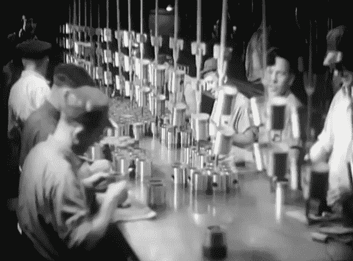

# 复古技术:30 年代制造汽车的魔力

> 原文：<https://hackaday.com/2014/03/25/retrotechtacular-the-magic-of-making-cars-in-the-30s/>

我们通常避免在我们的特征中称事物为“魔法”，因为，你知道… *科学*。但就[这辆 1936 年生产的雪佛兰卷轴](http://www.youtube.com/watch?v=VvAH-Yskyio)而言，它的展示简直就是工业化版的 [*【魔法师的学徒】*](http://en.wikipedia.org/wiki/The_Sorcerer%27s_Apprentice) 。嗯，不是恶作剧的意思，而是因为几乎没有任何解释，而且这些镜头被拼凑在一起的方式让你强烈地感觉到，在那个时候，这种类型的工业化是神奇的；现代奇迹。每个作品的技术和技能都是由师傅传给徒弟的，但实际上并不为公众所知。

这个夹子也嵌在下面，从机械车间开始，模具制造商在那里准备进入装配线生产。从那里，它被送到铸造厂进行零件铸造，然后进入冲压厂，在那里，白热的(也许是赤热的，但却是黑白的)金属被人工压制成型。上图是经过铸造、冲压和机加工的零件进入装配线。我们喜欢看到一屋子的活塞被用宽度规和千分尺手工检查。这部电影继续到成品车，我们认为你会同意这里有足够多的偷窥视频来克服缺乏叙事。

[https://www.youtube.com/embed/VvAH-Yskyio?version=3&rel=1&showsearch=0&showinfo=1&iv_load_policy=1&fs=1&hl=en-US&autohide=2&wmode=transparent](https://www.youtube.com/embed/VvAH-Yskyio?version=3&rel=1&showsearch=0&showinfo=1&iv_load_policy=1&fs=1&hl=en-US&autohide=2&wmode=transparent)

[感谢 Pretenda]

Retrotechtacular 是一个每周专栏，以旧时的黑客、技术和媚俗为特色。通过[发送您对未来分期付款的想法](mailto:tips@hackaday.com?Subject=[Retrotechtacular])，帮助保持新鲜感。