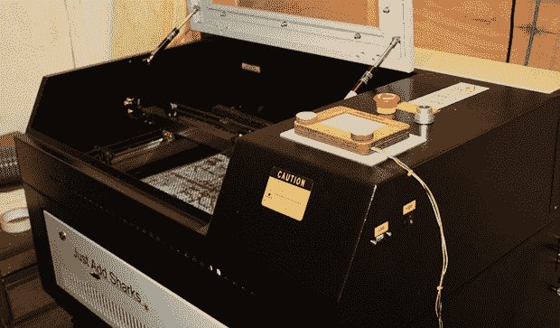

# 激光切割机成为蚀刻草图

> 原文：<https://hackaday.com/2014/03/27/laser-cutter-becomes-an-etch-a-sketch/>

激光切割机中的镜子沿 X-Y 轴移动。草图的蚀刻沿 X-Y 轴移动其触针。老实说，[这个带有蚀刻草图控制的激光切割机](http://www.justaddsharks.co.uk/arduino-based-etch-a-sketch-laser-cutter/)是如此明显，我们很震惊我们以前没有见过它。

Etch A Sketch 界面非常简单——只需将两个旋转编码器连接到一个小型激光切割框架内的激光切割旋钮上。来自编码器的线路连接到 Arduino Pro Mini，Arduino Pro Mini 与激光切割机上的控制器单元连接，仅在切割头移动时移动步进器并打开激光。还有一个额外的安全措施，即只有当盖子合上且水泵运行时才打开激光。

电路非常简单，只需几个连接，就可以在几分钟内将蚀刻草图控制器改装到激光切割机上。这正是周末黑客空间项目所需要的。

[https://www.youtube.com/embed/huxarKnxWU4?version=3&rel=1&showsearch=0&showinfo=1&iv_load_policy=1&fs=1&hl=en-US&autohide=2&wmode=transparent](https://www.youtube.com/embed/huxarKnxWU4?version=3&rel=1&showsearch=0&showinfo=1&iv_load_policy=1&fs=1&hl=en-US&autohide=2&wmode=transparent)