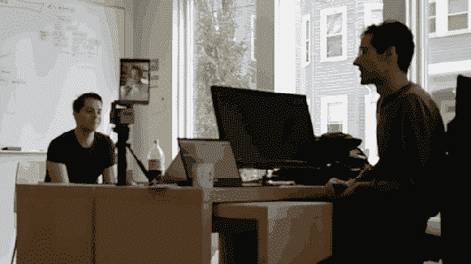

# 远程呈现机器人证明了这毕竟是一个小世界

> 原文：<https://hackaday.com/2014/03/27/telepresence-robot-proves-its-a-small-world-after-all/>

[Chris]在美国马萨诸塞州剑桥的一个小型开发团队中工作。他们的核心成员之一【提莫】，在德国海德堡远程办公。为了让[提莫]感觉与团队中的其他人更亲近，[他们为他建造了一个网真机器人](http://blog.printf.net/articles/2014/03/18/a-robot-for-timo/)。

这是一个与 DoubleRobotics 的链接，让创意源源不断。[Chris]和他的团队想把[Timo]带进房间，但是他们的预算中没有多余的 2499 美元。相反，他们将一个标准的[电动云台摄像机底座](http://www.adorama.com/BOMPHK.html)与一个 [RFduino](http://www.rfduino.com/rfd90101-teaser-kit.html) 蓝牙套件配对。在提莫手机上运行的一个应用程序通过互联网将陀螺仪的状态发送到机器人的 iPad 上。机器人的 iPad 然后通过蓝牙将数据发送到 RFduino。RFduino 命令与陀螺仪感应到的相对应的平移和倾斜运动。一个视频聊天应用程序运行在所有这些之上，允许[Timo]环视房间并与他的同事交谈。

所有的源代码都可以通过 GitHub 获得。这个设计一开始并不完美。[Chris]提到 RFduino 的蓝牙 API 在进行配对操作时相当脆弱。最终，这个团队完成了这个机器人，并把它作为情人节礼物送给了提莫。为了[克里斯]的缘故，我们希望[提莫]不要花太多的时间做他的主页网址所暗示的事情:[" screamingatmyscreen . com "](http://screamingatmyscreen.com/)

[谢谢帕克]