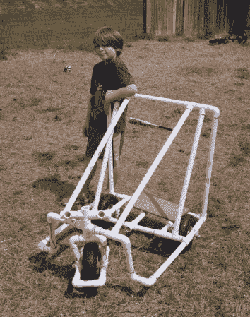

# 廉价轮胎销售激发创意

> 原文：<https://hackaday.com/2014/03/29/cheap-tire-sale-sparks-creative-contraption/>

[格雷格]和他的孩子在他们的(他的)消磨时间？)最喜欢的店——海港货运。他们注意到 10 英寸的橡胶轮胎只卖 5 美元/个… [,而且都是从那里开始的。](http://gregsowell.com/?p=4779)

他开始为一辆三轮卡丁车勾勒出一个总体构想。一旦他对它的外观有了合理的想法，他就去五金店买了一大堆 1 英寸的 PVC 管、三通、弯头、十字、环氧树脂和紧固件。

这是一个简单的手推车，带有防滚架。目前，它只是为被推来推去或骑下山而设计的。对孩子们来说，这看起来还是很有趣的。我们不禁想知道他什么时候会给它装上一些电动马达，让它对孩子们来说真的很有趣。也许建第二个，在框架周围放些面条，然后，你就有了一套碰碰车！如果他需要任何电子产品的灵感，[Greg]可以看看这个[无线 Wii-Cart](http://hackaday.com/2012/05/11/the-wiikart-a-wireless-go-kart/) ，或者这个[超动力内置一日推车](http://hackaday.com/2014/02/27/mini-go-kart-built-in-a-day/)。

[https://www.youtube.com/embed/B7audt8_OhE?version=3&rel=1&showsearch=0&showinfo=1&iv_load_policy=1&fs=1&hl=en-US&autohide=2&wmode=transparent](https://www.youtube.com/embed/B7audt8_OhE?version=3&rel=1&showsearch=0&showinfo=1&iv_load_policy=1&fs=1&hl=en-US&autohide=2&wmode=transparent)

[谢谢安德鲁]