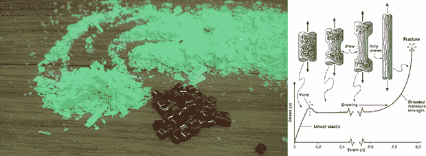

# 用液氮回收塑料

> 原文：<https://hackaday.com/2014/03/29/recycling-plastic-with-liquid-nitrogen/>

回收 3D 打印机细丝并不是一个新想法，事实上，有相当多的设备可以将大块 ABS，PLA 或任何其他热塑性塑料转化为打印机细丝。当有人提到回收塑料部件并把它们变成可以再次使用的细丝时，问题就来了。塑料只能循环使用几次，而且还有一个问题，就是把你的八足动物和同伴立方体磨成细丝挤压机可以接受的东西。

看起来，解决的办法是在粉碎塑料部件之前，将它们冷冻回收。在室温下切碎塑料部件会在塑料破裂前向其注入大量能量。将零件冷冻到低于它们的脆性转变温度，意味着最终的切片将具有整齐的切口，这更适合细丝挤出机的机械结构。

这个实验的装置包括用液氮冷却 PLA 塑料，并将冷冻的部分放入一个便宜的搅拌机中，就像电视上看到的那样。产生的碎片比注塑制造厂的塑料颗粒要小，但能很好地进入挤出机。

在这种情况下，液氮的杀伤力可能过大；目标是将塑料冷却到其脆性转变温度以下，对于大多数塑料来说，脆性转变温度约为-40 (420 R)。干冰也能起到同样的作用，而且在大多数沃尔玛超市也能买到。