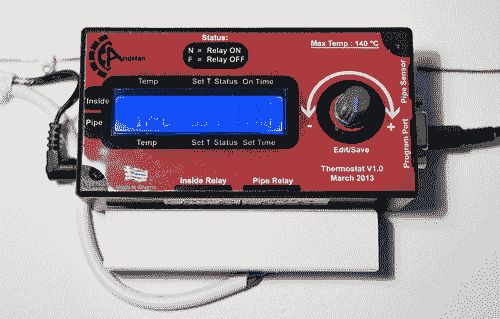

# 节能壁炉恒温器

> 原文：<https://hackaday.com/2014/03/29/energy-saving-fireplace-thermostat/>

[安德里安]有一个锅炉炉子，它将水加热并送到散热器。当壁炉加热锅炉里的水时，一个温度传感器打开阀门将热水送到散热器。散热器将冷水送回锅炉重新加热。阀门是缓慢的，所以在锅炉将所有的水送到散热器之前，它将冷水送回，导致阀门关闭，同时热量积聚起来。为了防止阀门如此费力地工作并浪费能量，[Andrian] [设计了一个更好的恒温器来控制阀门的操作](http://www.candrian.gr/index.php/thermostat-v1-0/)。

恒温器使用一个 LM85 温度传感器检查锅炉中的水，另一个传感器检查环境温度。一旦锅炉水达到所需的温度，阀门通过继电器打开。系统等待半小时，然后再次检查锅炉温度。这个操作的大脑是一个 ATMega168，它有一个 32.768kHz 的晶体作为 RTC。代码和 PCB 文件可在 [his repo](https://github.com/candrian/Thermostat) 中获得。

我们喜欢看到这些挑战现状、提高设备效率的黑客。我们为你(安德里安)鼓掌，因为你将你的不满转化为积极的行动计划，并与我们分享你的经验！

如果你想增加热水的环保性，你可以用堆肥堆来加热水。