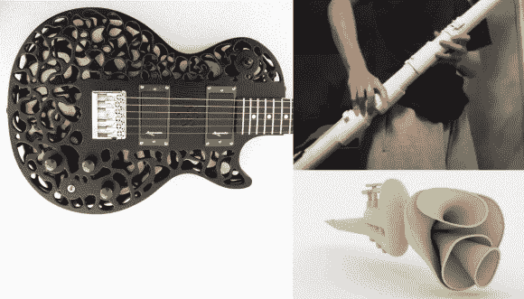

# 3D 打印仪器综述

> 原文：<https://hackaday.com/2014/03/29/3d-printed-instrument-roundup/>

我们只是偶然发现了一个巨大的 3D 打印音乐资料库。这是一个致力于分享和记录这些 3D 打印工具的 wiki 】,以帮助鼓励进一步的想法和项目。

维护网站的人找到不同的项目并分享它们，添加描述，这些描述会很好地进入数据库搜索。他们解释了仪器的类型，它的历史，它的图片或视频以及用于创作的制造方法，无论是传统的 3D 打印，激光切割还是其他工艺。

我们最喜欢的一些包括由麻省理工学院媒体实验室制作的 [3D 打印吉他琴身](http://hackaday.com/2014/01/25/3d-printed-guitar/)，奇怪的多角小号(这是最奇怪的一个，右下角)，当然还有巨大的低音录音机(右上角)。

休息后留下来看几段这些~~不同~~非传统、非正统乐器的视频！

[https://www.youtube.com/embed/zwHgszH0aqI?version=3&rel=1&showsearch=0&showinfo=1&iv_load_policy=1&fs=1&hl=en-US&autohide=2&wmode=transparent](https://www.youtube.com/embed/zwHgszH0aqI?version=3&rel=1&showsearch=0&showinfo=1&iv_load_policy=1&fs=1&hl=en-US&autohide=2&wmode=transparent)

[https://www.youtube.com/embed/F9VdXtTlhCU?version=3&rel=1&showsearch=0&showinfo=1&iv_load_policy=1&fs=1&hl=en-US&autohide=2&wmode=transparent](https://www.youtube.com/embed/F9VdXtTlhCU?version=3&rel=1&showsearch=0&showinfo=1&iv_load_policy=1&fs=1&hl=en-US&autohide=2&wmode=transparent)

[https://www.youtube.com/embed/XU3AZmf6O7I?version=3&rel=1&showsearch=0&showinfo=1&iv_load_policy=1&fs=1&hl=en-US&autohide=2&wmode=transparent](https://www.youtube.com/embed/XU3AZmf6O7I?version=3&rel=1&showsearch=0&showinfo=1&iv_load_policy=1&fs=1&hl=en-US&autohide=2&wmode=transparent)

或者这款酷毙了的[极简 3D 打印吉他……](http://hackaday.com/2011/02/16/printing-your-own-guitar-parts/)