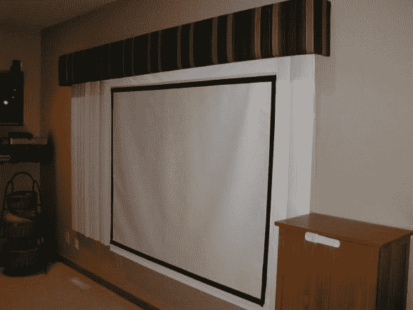
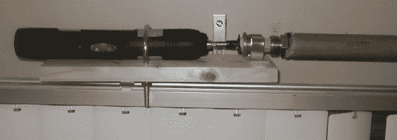

# 神奇螺丝刀决定你看不看电视

> 原文：<https://hackaday.com/2014/03/31/magic-screwdriver-decides-if-you-watch-tv-or-not/>

视频投影仪很棒。他们可以很容易地产生一个非常大的图像来观看。伴随着大图像而来的是大屏幕，谁愿意在不看电视的时候看大屏幕呢？嗯，[史蒂夫]也没有，所以他开始为他的投影仪做一个[电动可伸缩屏幕](http://www.avsforum.com/t/617607/diy-electric-roll-up-screen)。关于这个最好的部分是，它是在真正的 DIY/黑客时尚中完成的。所使用的部件绝对不是用来靠近投影仪屏幕的，并且总成本保持在绝对最低水平。

这个项目的商业端是电动螺丝刀。它被安装在一个架子上，这个架子的唯一目的就是支撑这个装置。屏幕绕着标准的硬纸板管滚动。螺丝刀头、木制销钉、青铜衬套和水管配件负责将钻头连接到纸板管。将青铜衬套保持在适当位置的是一个用于扫帚把手等的夹子。整个事情被一个檐口掩盖了，以隐藏 hackery。

为了升高和降低屏幕，[史蒂夫]必须伸出手，手动按下螺丝刀上的按钮。在未来，我们希望看到一个有线或红外遥控器来控制屏幕，这样它就可以在舒适的沙发上升降。