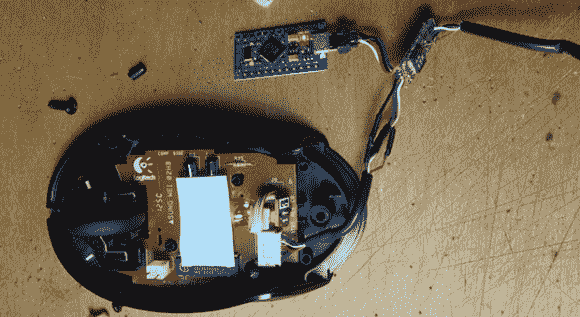

# 鼠标中真正的恶意软件

> 原文：<https://hackaday.com/2014/03/31/a-real-malware-in-a-mouse/>

在读了一个我们上当的愚人节玩笑后，【Mortimer】[决定复制这个项目](https://imgur.com/a/uOhyn)，将普通的 USB 鼠标变成一个可以搞垮公司和政府的强大工具。实际上，他只是给了自己一键访问 Hackaday 的权限，但那也一样好。

这种改良老鼠的内脏非常简单；在 Arduino Pro Micro 上，鼠标的左键单击、右键单击和滚轮单击连接到三个引脚。“duino”的 USB 端口配置为 USB HID 设备，能够响应鼠标上的任何输入发送键盘命令。

现在，[莫蒂默]已经配置了这款鼠标，当按下左键时，它会高亮显示浏览器的地址栏，并输入[http://www.hackaday.com](http://www.hackaday.com)。不像[用光学传感器读取印在鼠标垫](http://hackaday.com/2014/03/30/malware-in-a-mouse/)上的极小代码那样具有颠覆性，但足以构建这个项目并对计算机造成一些严重破坏。

下面是[莫特]的鼠标的视频。

[https://www.youtube.com/embed/83S-yxZv9Ko?version=3&rel=1&showsearch=0&showinfo=1&iv_load_policy=1&fs=1&hl=en-US&autohide=2&wmode=transparent](https://www.youtube.com/embed/83S-yxZv9Ko?version=3&rel=1&showsearch=0&showinfo=1&iv_load_policy=1&fs=1&hl=en-US&autohide=2&wmode=transparent)