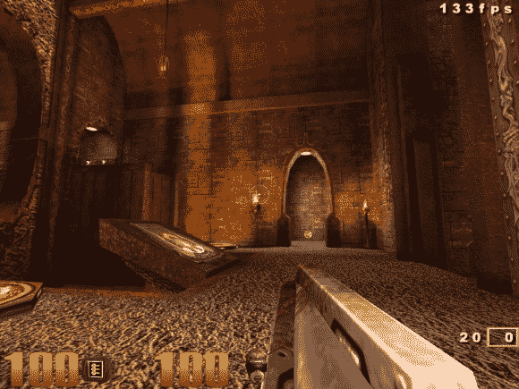

# 树莓 Pi 地震三赏金声称

> 原文：<https://hackaday.com/2014/03/31/raspberry-pi-quake-iii-bounty-claimed/>

在树莓派的第二个生日，Raspi 基金会给了我们一份非常酷的礼物。Broadcom 发布了他们一款手机芯片上图形的完整文档，并向第一个将代码移植到 Pi 图形处理器并运行 Quake III 的人提供 1 万美元的奖金。[该奖项已经获得](http://www.raspberrypi.org/archives/6561)，为任何想要在 Pi 上获得完整记录的视频核心的人奠定了基础。

获得这个奖项的人是西蒙·霍尔，他是当前 Raspbian 版本中 DMA 模块的作者。尽管 Quake III 已经在 Pi 上运行，但它是通过一个封闭的源代码驱动程序来运行的。[Simon]的工作向所有人开放了 Pi 中的视频核心，尤其是对那些反对 Pi 平台局限性的人非常有用。

你现在就可以得到新的视频驱动程序，只需下载并编译所有的源代码。但是要注意:重新编译所有东西需要大约 12 个小时。我们期待 Raspbian 的更新。