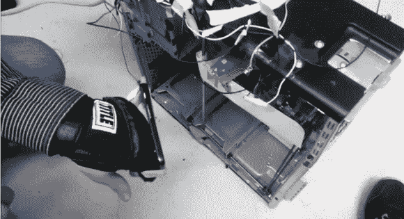
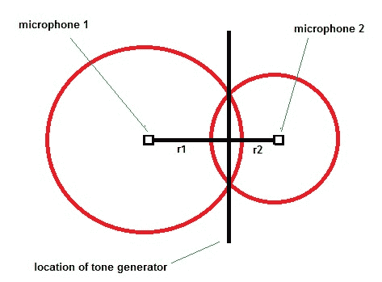
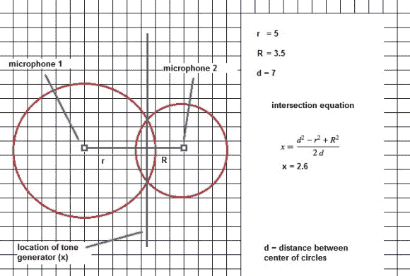

# 拳击+ Arduino +几何=牛逼

> 原文：<https://hackaday.com/2014/04/02/boxing-arduino-geometry-awesomeness/>

想象一下，一台[安德森·席尔瓦]可以挥拳猛击的机器，它可以实时定位他的拳头，并移动拳垫来迎接他移动的拳头。你会怎么做？Kinect？超级巨大的传感器阵列？贴符咒？如果我们告诉你，它可以用两个驻极体麦克风、一个 Arduino 和一个 Gumstix 来实现，会怎么样？是啊，没错。你可能想关掉手机，坐下来听这个。

[Benjamin]和他的同学为他们的最终项目开发了这个出色的概念验证设计[,可以阻挡来袭的拳头](https://www.youtube.com/watch?v=SuFLsGDEzUU&feature=youtu.be)。在之前，我们已经在这里看过[拳击机器人，但这一个最棒。细节很少，但我们已经深入了解了我们所能获得的信息，并对他们如何完成这个令人敬畏的电气工程有了一个相对较好的想法。](http://hackaday.com/2010/08/03/robot-boxing-with-wrist-watches/)

考虑两个固定在轴两端的麦克风。然后考虑一个可以在同一轴上来回移动的音调发生器。每个麦克风发出的波形的幅度将与麦克风和音调发生器之间的距离的平方成反比。更简单地说，振幅将遵循平方反比定律。这些值乘以一个常数，可以用来表示圆的半径(r)，由此可以导出圆的方程(x²+y²= r²)。因为有两个麦克风，所以有两个圆圈。或者更具体地说，是(r)的两个值，我们称之为(r1)和(r2)。

[Benjamin]的任务是精确定位音调发生器源(连接在拳击手套上)的确切位置，并移动目标将其拦截。放大后，来自每个麦克风的信号被送入 Arduino，在那里进行平均。然后，他通过 I2C 将峰值数据发送到 Gumstix。仅从这些数据中，人们或许可以大致了解音调发生器的位置。但是[本杰明]和他的团队想要一个准确的位置，并使用了 Gumstix 中作为算法运行的所谓的[圆-圆相交方程](http://mathworld.wolfram.com/Circle-CircleIntersection.html)。这给了他两个圆相交的轴上的精确位置，以及音调发生器源的位置。从这一点来看，将防护装置(阻挡冲头的部分)移动到该位置相对简单。红外传感器用于确定防护装置的当前位置，Gumstix 通过 PWM 和 H 桥将其移动到打孔位置。太棒了。

我们通过数学逐步演示了圆-圆相交算法是如何求解位置的。你可以计算方块来代表数据。2.6 的答案是较小圆的圆心到交点的距离。你可以通过简单地交换等式中的(R)和(R)来获得从较大的圆到交点的距离。试试看！

这种确定移动物体沿单轴位置的技术对于其他黑客来说一定会很方便。