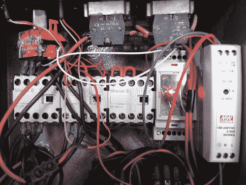

# Arduino 控制的 Dahlander 电机开关

> 原文：<https://hackaday.com/2014/04/02/arduino-controlled-dahlander-motor-switch/>

[Jean-Noel]正在修理一台坏了的 Lurem 木工机器。本机采用三相 Dahlander 电机，有三种运行模式:停止、半速、全速。电机使用特殊的机械开关来选择运行模式。不幸的是，开关内部的机械零件坏了，马达无法启动。

为了在不采购新交换机的情况下解决这个问题，[Jean-Noel]构建了自己的基于 Arduino 的 Dahlander 交换机。它由三个继电器组成，为每个速度模式选择接线配置。还有一个按钮来切换设置，两个灯来显示电机当前的模式。

Arduino 运行一个[有限状态机](http://en.wikipedia.org/wiki/Finite-state_machine) (FSM)，确保设备以正确的顺序在模式间转换。这一点非常重要，因为如果不遵守某些限制，电机可能会损坏。状态机图是使用 [Fizzim](http://www.fizzim.com/) 生成的，这是一个免费工具，不仅可以生成 FSM 图，还可以为机器生成 Verilog 和 VHDL 代码。

最终产品封装在一个 d in 导轨盒中，这使得它可以与其余线路一起安全安装。关于这个项目的详细报道解释了电机的所有细节，以及制造这种替代开关的挑战。