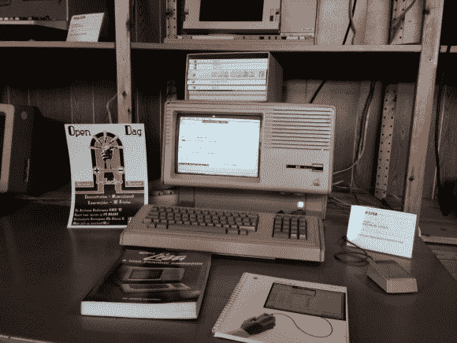
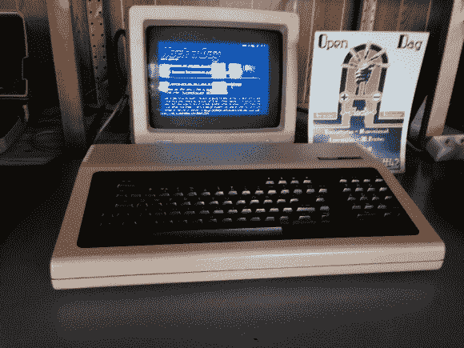

# 黑客一天在电脑博物馆复古

> 原文：<https://hackaday.com/2014/04/07/hack-a-day-goes-retro-in-a-computer-museum/>

我们在荷兰 [Hack42](https://hack42.nl/blog/) 的朋友决定去他们的电脑博物馆玩一玩。到目前为止，他们已经能够在三台经典电脑上显示 Hack a Day retro 网站，包括 Apple Lisa、DEC GIGI 和 run of the mill DEC VT100。去年 10 月，在我们的[欧洲黑客空间之旅](http://hackaday.com/2013/11/06/hackerspacing-in-europe-conclusion/)中，我们有机会[拜访了 Hack42](http://hackaday.com/2013/11/01/hackerspacing-in-europe-hack42-in-arnhem/)——但是提醒一下，如果你不记得的话，hack 42 是在荷兰的阿纳姆——就在德国之外。这座建筑建于 1942 年，是一个德国军事基地，伪装成一堆农舍。它现在是 Hack42、艺术家工作室和其他随机企业的所在地。有趣的是，它的位置[在谷歌地图上仍然模糊不清！不用说，他们的黑客空间很大。说真的。以至于他们有自己的电脑博物馆！这就是为什么他们决定用它们来玩… 为了在这些旧电脑上进行一天的复古，他们使用一台旧的 Debian Compaq 机器作为 DECServer90m 的主机。DECServer90m 是一个远程串行端口服务器，有 8 个可配置的串行端口。它被用作 VAX、nicorVAX 或其他类似计算机的终端服务器。它使用要配置的同轴以太网进行连接。串行端口可以设置为打印机、调制解调器，或者在这种情况下，像 DEC VT100 或 Apple Lisa 这样的哑终端。](https://maps.google.co.uk/maps?q=52.034324,+5.874641&hl=en&sll=52.156344,6.078356&sspn=0.377873,1.056747&t=h&z=16)

An Apple Lisa

Lisa 是第一批使用鼠标和图形桌面的系统之一！

DEC GIGI

> DEC GIGI VK100 是一个奇怪的野兽。就连 DEC 也不知道该如何看待它，也不能正确地推销这台机器，认为它只是一个支持彩色和一些额外的小发明如 basic 和 graphics 的哑终端。它看起来像一个超大号的 Commodore C64，但它背面有一些漂亮的连接器，像一个电流环(用于串行连接到甚至比 VAX 更旧的计算机，如 PDP8 小型机和三个 BNC 连接器，用于分量彩色输出。)

他们目前正在研究一种更复杂的方法，让一些真正的旧电脑显示页面！