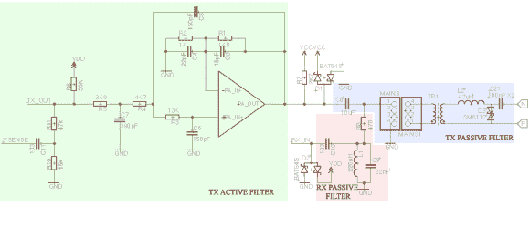

# 开源电力线通信

> 原文：<https://hackaday.com/2014/04/05/open-source-power-line-communication/>

因为我们的房子里到处都有电线来提供电源，所以有很多设备都依赖于电源线来进行通信。为了他的论文项目，【Haris Andrianakis】[开发了自己的电力线通信系统](http://www.candrian.gr/index.php/power-line-communication/)。

该系统的基本原理是以比交流电源本身的 50 或 60 Hz 高得多的频率将信号注入电力线。使用有源和无源滤波器，可以将信号从交流电源中分离出来并进行解码。该系统使用[频移键控](http://en.wikipedia.org/wiki/Frequency-shift_keying)对数据进行编码。这部分由一个为电力线应用设计的 [ST7540](http://www.st.com/web/catalog/sense_power/FM1968/SC923/PF130228) 调制解调器完成。调制解调器由 ATmega168 微控制器通过 SPI 控制。

[Haris]的文章详细介绍了他面临的一些挑战，以及如何保护设备免受高电压的影响。最终结果是电子秤的远程显示，通过电力线进行通信。原理图、PCB 布局和软件一应俱全。