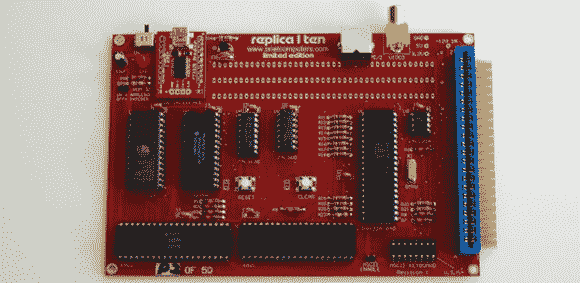

# VCF·伊斯特(文斯·布瑞尔):布瑞尔计算机公司的

> 原文：<https://hackaday.com/2014/04/07/vcf-east-vince-briel-of-briel-computers/>

从本周末老式电脑节的寄售区来看，从家用电脑时代的黎明开始，老式电脑和其他昙花一现的东西仍然有一个蓬勃发展的市场。更有趣的是使用现代部件对老式电脑的重新想象，正如[文斯·布瑞尔] [和他令人惊叹的改装电脑套件](http://www.brielcomputers.com/)所示。

[文斯]这周末在东 VCF 展示他的一些商品。到目前为止，最令人印象深刻的(阅读:最闪亮的灯)是他的牵牛星 8800 套件，它模仿了微型计算机革命的起源，牵牛星。里面没有老式的硬件，一切都是在 ATmega 微控制器上模拟的。尽管如此，对于挑剔的复古电脑爱好者来说，它足够准确，并有 VGA 输出，键盘端口和 SD 卡插槽。

副本 I 是原始苹果的一个非常精简的版本，使用原始的 6502 CPU 和 6821 PIA。板上的其他一切都很现代，有一个串行到 USB 控制器用于输入，还有一个视差推进器用于视频。即使有了这些现代芯片，扩展槽仍然存在，允许串行卡或光盘驱动器连接到计算机。

下面的视频，【文斯】展示了他所有的商品，包括他非常酷的 Kim-1 复制品。

[https://www.youtube.com/embed/BVRZn1gg1y0?version=3&rel=1&showsearch=0&showinfo=1&iv_load_policy=1&fs=1&hl=en-US&autohide=2&wmode=transparent](https://www.youtube.com/embed/BVRZn1gg1y0?version=3&rel=1&showsearch=0&showinfo=1&iv_load_policy=1&fs=1&hl=en-US&autohide=2&wmode=transparent)