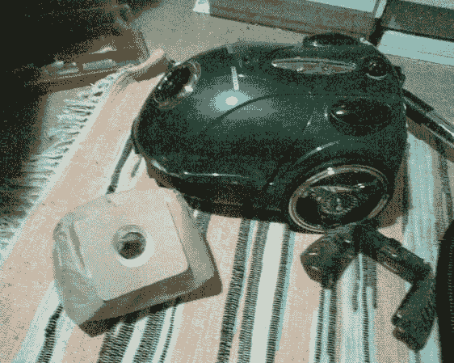

# 可重复使用的真空袋为您省钱

> 原文：<https://hackaday.com/2014/04/06/reusable-vacuum-bag-saves-you-money/>

真空集尘袋很讨厌。它们很贵，一次性使用，如果你有一个旧的真空吸尘器，祝你好运找到替代品！[卡尔]厌倦了，所以他决定自己制作一个可重复使用的垃圾袋。

他使用一件旧 t 恤作为新的包包材料，但他指出，你也可以使用任何其他足够通风的材料——只要它能阻挡灰尘但让空气通过，你就没事了！为了密封袋子，他使用了一块橡胶乙烯树脂，上面开了一个洞来密封进气管。这是用一块纸板夹着布料缝在 t 恤上的。从那以后，只需添加一个拉链或 Velcro，就大功告成了！

他已经使用这个过滤器一年多了，还没有出现任何问题——你甚至可以清洗它！既然如此，为什么不为你的吸尘器也做一个[湿溅附件](http://hackaday.com/2013/06/13/wet-spill-vacuum-cleaner-attachment/)？