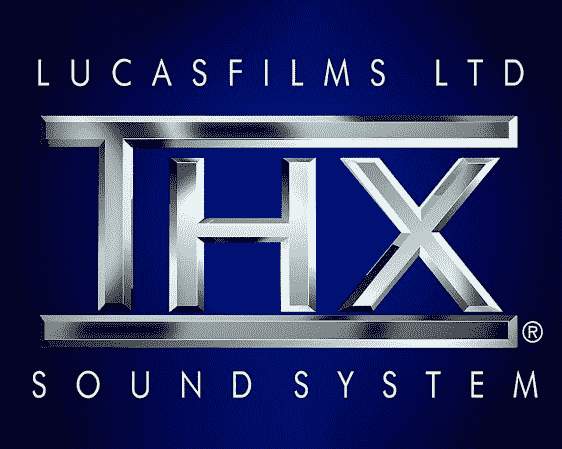

# 再现 THX 深度音符

> 原文：<https://hackaday.com/2014/04/07/recreating-the-thx-deep-note/>

很少有声音像 THX 深沉的音符那样容易辨认。[巴图汉]做了一些研究，[着手重现声音](http://www.earslap.com/instruction/recreating-the-thx-deep-note)。最初的[深度音符](http://www.uspto.gov/trademarks/soundmarks/74309951.mp3) (mp3 链接)是由【詹姆士·a·穆勒博士】于 1982 年创建的。[穆尔博士]使用音频信号处理器(ASP)(又名 [SoundDroid](http://en.wikipedia.org/wiki/SoundDroid) )来创造声音。ASP 是一台编程复杂的机器。深度笔记用了大约 20000 行 C 代码编程。C 代码被编译成大约 250，000 条离散的语句来命令 ASP。

只有一个 ASP 曾经建成，卢卡斯影业拥有它。[巴图汉]没有重建硬件，而是使用[超级对撞机](http://supercollider.sourceforge.net/)来重建声音。就像 ASP 一样，SuperCollider 是一个实时音频合成工具。不同的是，SuperCollider 是开源的，运行在现代计算机上。[巴图汉]用他的研究和耳朵对深音符进行了分析。他创造了两个再创造。第一个是精心制作的，用来复制声音。第二个是值得 Twitter 个字符的版本。这两个版本都是原始深度音符的合理模仿，尽管它们在我们听来并不完美。

[巴图汉]不是唯一一个从事娱乐活动的人。在[http://thx.onekb.net](http://thx.onekb.net/)/可以听到 1KB JavaScript 中的深音符。我们很乐意听到 Hackaday 读者创作的其他版本！

[Via [Reddit](http://www.reddit.com/r/programming/comments/228fmo/recreating_the_thx_deep_note/)