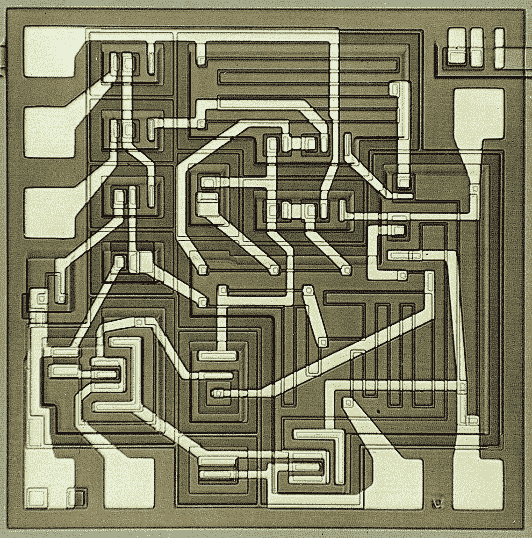
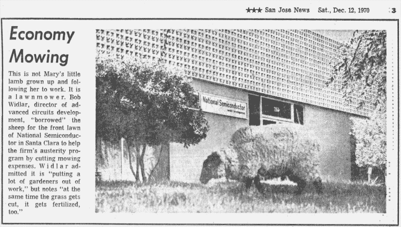

# 硬件革命的英雄:鲍勃·威德拉

> 原文：<https://hackaday.com/2014/04/08/heroes-of-hardware-revolution-bob-widlar/>

鲍勃·威德拉(1937-1991)无疑是有史以来最著名的硬件工程师之一。其实说他是单枪匹马开创了整个模拟 IC 行业的人，一点都不为过。当然，是罗伯特·诺伊斯和杰克·基尔比发明了集成电路的概念，但是是 Widlar 的天才和实用主义赋予了它生命。尽管他不是第一个意识到平面工艺和设计分立式电路等 IC 的局限性的人，但他是第一个提供实际解决方案的人——第一款线性 IC 运算放大器 A702。结合他的工程天赋、对电路设计经济方面的理解以及对介质和工艺限制的认识，他和 Dave Talbert 在整个 60 年代和 70 年代统治了模拟 ic 世界。在相当长的一段时间里，全世界 80%以上的线性电路都是由他们制造和销售的。

他的设计清单包括 A709、对原始 A702 的改进和飞兆多年来的旗舰产品 A723(第一个集成稳压器)和 LM10(第一个超低压运算放大器，至今仍在生产)。学生通常通过教科书了解 Widlar，经典的: [Widlar 电流源](http://en.wikipedia.org/wiki/Widlar_current_source)，他的许多设计中的关键部分，以及[带隙电压基准](http://en.wikipedia.org/wiki/Bandgap_voltage_reference)——这两者都提供了无限的令人难以置信的考试问题。如果说 Widlar 的所有设计有一个共同的主题，那就是他一生中从未设计过明显的赛道。每一个 Widlar 设计都有一个转折，一个独特的想法，通常是一个恶作剧。一个经典的例子是业界首款三端可调稳压器 LM109 的故事。1969 年，Widlar 写了一篇论文，他反对单芯片稳压器的可行性，因为温度波动和封装限制。由于那时他已经是工程界的传奇人物，工业界对此很重视，人们也放弃了对这种设备的追求。然后在 1970 年，他提出了一种电路——lm 109——利用他的带隙基准电压源实现了这种“不可能”的功能。很有可能他在几天之内就提交了两份作品。

除了是一名出色的设计师之外，Widlar 还是 Sillicon Valley 未来时代的化身，他将反文化和挑战性的态度与创业激情和制造人们喜爱的产品的愿望结合在一起。他直接与客户合作，编写自己的应用笔记和数据表。事实上，Widlar 的 A702 为未来所有模拟 IC 数据手册的编写方式绘制了蓝图。他的原则是“设计最少的电话呼叫”和“如果你制造一百万个集成电路；如果它们工作不正常，你会接到 50 万个电话。他既是世界的破坏者，也是新市场的创造者；他进入飞兆时声称“他们在模拟领域所做的都是废话”，但离开公司时，他已经是线性 IC 领域的主导者，主要是凭借他的设计。然后他去了 Molectro(归 National 所有)，但很快结束了对母公司的颠覆，成为一个模拟发电站。33 岁时，他在墨西哥退休。但是他的手不能闲着太久。他很快以承包商的身份回到国家公司，并于 1980 年与罗伯特·斯旺森和鲍勃·多布金一起创立了线性技术公司。

尽管如此，他始终是一个麻烦制造者、自由思想者和人力资源噩梦…在精神上更接近海明威这样的人，而不是一个“专业”工程师。这种态度是有感染力的，它激发了一个全新的“恶作剧”模拟天才的浪潮，如鲍勃·皮斯和吉姆威廉姆斯。威德拉的恶作剧数不胜数，很难挑出一个最能抓住时代精神的。也许是当 Widlar 把羊带到 National 的前面，作为对该公司因削减成本而不修剪草坪的反应(他真的只是需要一个借口来惹恼上层管理人员)。或者当他又一次用樱桃炸弹袭击了内部通话器的扬声器，只是为了让一位国家副主席不高兴。一些恶作剧是实际的硬件，如他建造的“hassler”电路，用于检测音频，将其转换为非常高的音频频率，并播放转换后的声音。这种设计的最终效果是，有人在办公室里说话的声音越大，由反馈引起的“响铃”效应就越令人讨厌。当一个人停止叫喊去听是什么引起了铃声时，这种效果也会消失。这样，他设法让办公室里的每个人都像巴甫洛夫那样小声说话。

Widlar 于 1991 年去世，但他的遗产永存。他是真正的原始硬件黑客，不仅仅是一名工程师，他还是一名艺术家。正是因为像他这样的人，Analog 仍然有那种特殊的感觉，并且更多地是关于“发明”，而不仅仅是沿着 A 和 b 之间的简单路径。这就是为什么 Analog 的人仍然用“Widlar Salute”来问候其他人。

> 现在，当我完成检查后，我仍然非常生气，因为我浪费了很多时间被一个坏的组件愚弄了——我该怎么办？我通常会把它具体化，这让我感觉好多了。你如何使某事变得宽泛？你把它拿到老虎钳的铁砧上，用锤子敲打它，直到它被压碎成很小很小的碎片，小到你甚至不用把它从地板上扫下来。这会让你感觉更好。你知道那个组件再也不会让你烦恼了。这不是一个笑话，因为有时如果你有一个坏的罐子或坏的电容器，你只是把它放在一边，几个月后你发现它滑回你的新电路，再次浪费你的时间。当你将某件事全球化时，那是不会发生的。已故的 Bob Widlar 告诉了我怎么做。
> 
> 鲍勃·皮斯-模拟电路故障排除

### 参考

[1]Bo Lojek——半导体工程历史，施普林格出版社，2007 年

[2]鲍勃·皮斯–模拟电路故障排除，1987 年

[3][http://en.wikipedia.org/wiki/Bob_Widlar](http://en.wikipedia.org/wiki/Bob_Widlar)

[4][http://readingjimwilliams . blogspot . com/2012/04/my-favorite-wid lar-story . html](http://readingjimwilliams.blogspot.com/2012/04/my-favorite-widlar-story.html)

[5][http://analog footwes . blogspot . com/search/label/Bob % 20 wid lar](http://analogfootsteps.blogspot.com/search/label/Bob%20Widlar)

[6][http://electronic design . com/analog/what-s-all-wid lar-stuff-anyway](http://electronicdesign.com/analog/what-s-all-widlar-stuff-anyhow)

[7][http://silicongenesis . Stanford . edu/transcripts/dobkin Williams . htm](http://silicongenesis.stanford.edu/transcripts/dobkinwilliams.htm)

[8][http://edn . com/electronics-blogs/anablog/4311277/Bob-wid lar-cherry-bombs-the-intercom-speaker-item-2](http://edn.com/electronics-blogs/anablog/4311277/Bob-Widlar-cherry-bombs-the-intercom-speaker-item-2)